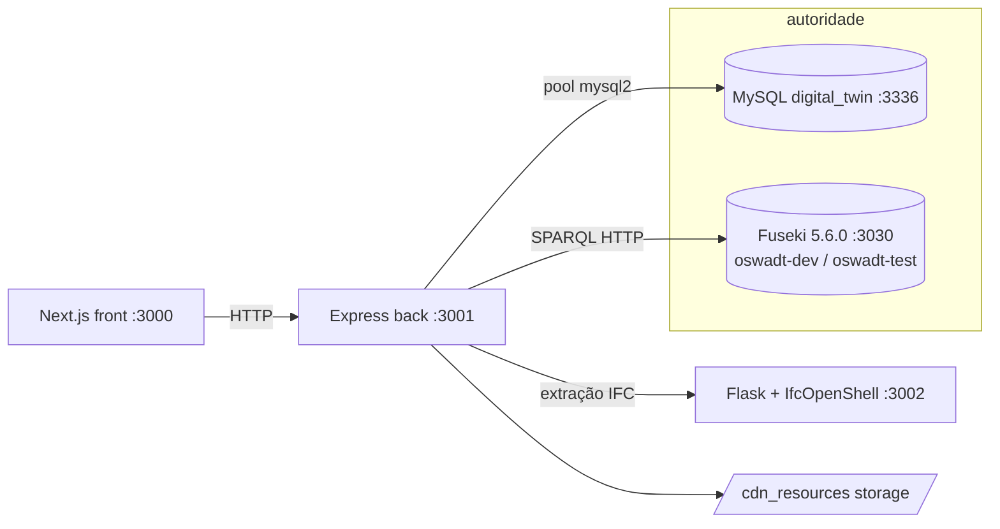
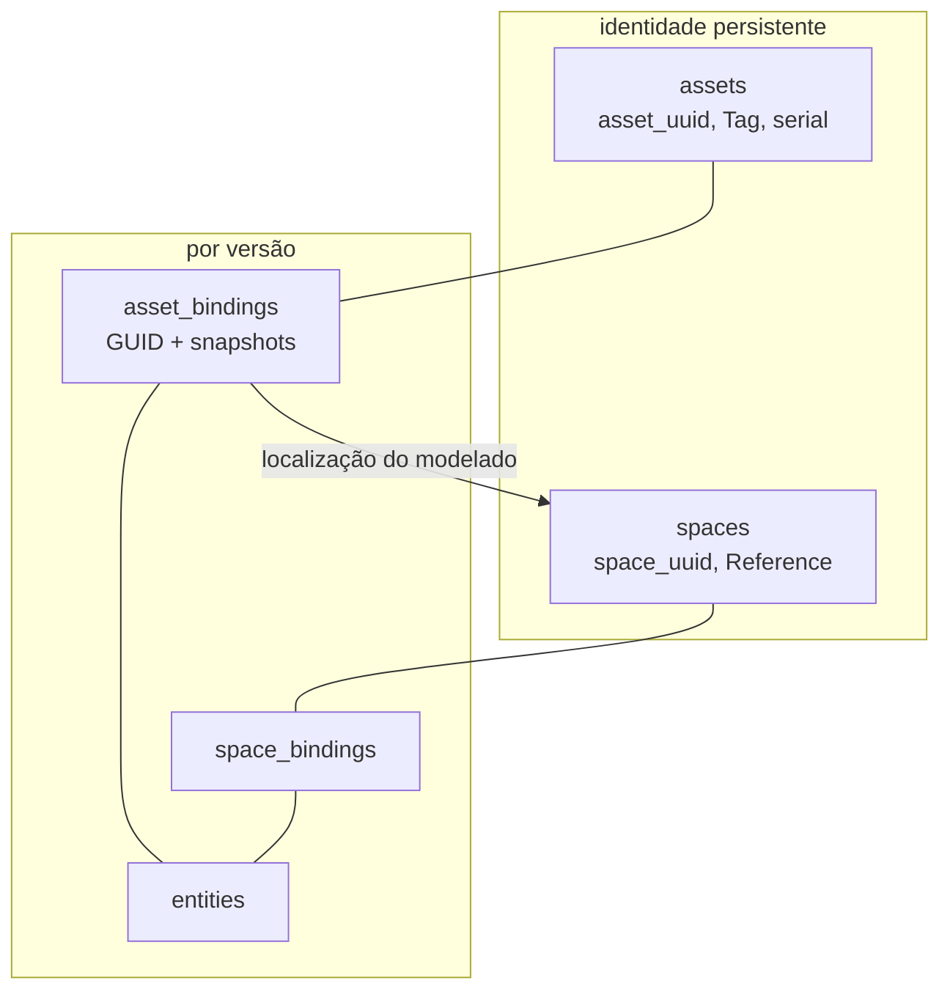
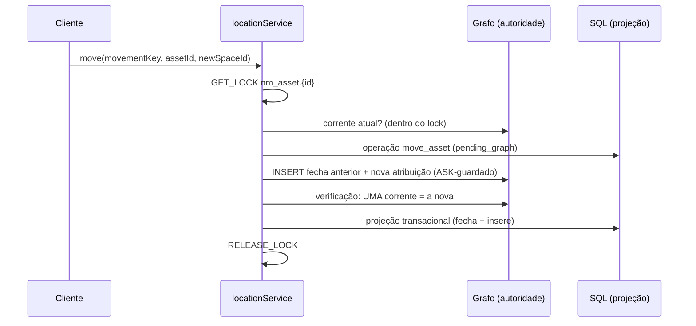
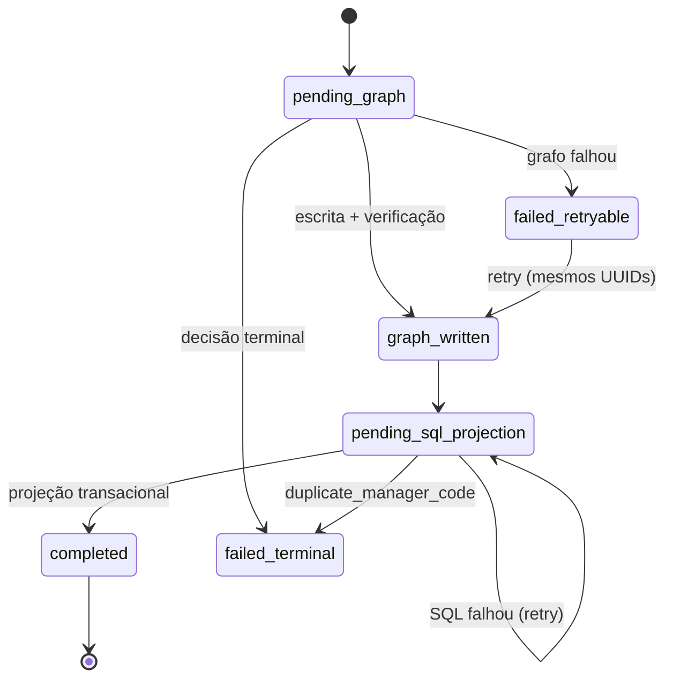
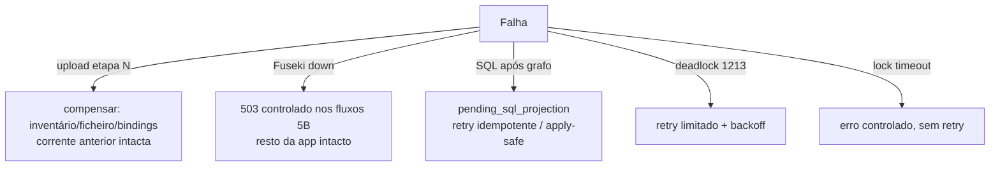

# OSWADT — Arquitetura Consolidada (Prompt 7D, 2026-07-20)

Visão viva do protótipo após os Prompts 0–6, 7B1 e 7B2. Fontes de verdade: código,
migrations, testes, ADRs (0001–0039), MANUAL_TESTS.md. Secção final descreve
o trabalho semântico FUTURO — nada aí está implementado.

## Arquitetura geral



O frontend NUNCA escreve diretamente no grafo nem nas tabelas de projeção —
toda a alteração passa pelos serviços do backend (guardado por teste).

## 15.1 Model Versioning (Prompt 2; ADR-0001..0004)

- `linked_models` = federação; `models` = linha lógica persistente;
  `model_versions` = revisões imutáveis (ficheiro por versão, hash, tamanho,
  storage_key; nunca sobrescrito).
- A corrente é EXPLÍCITA: `models.current_version_id` — nunca "o maior id".
- Estados: `processing → active → archived`; `processing → failed` (failed
  nunca é corrente; archived recuperável).
- Falha em qualquer etapa: compensações apagam inventário/ficheiro/bindings da
  versão falhada; a versão anterior CONTINUA corrente; linha `failed`
  preservada para diagnóstico.
- Concorrência (P2 + P6): `version_number` reservado em transação dedicada com
  `FOR UPDATE` em `models` + UNIQUE(model_id, version_number); ativação
  serializada; ver ADR-0030 (fundação pool).

```mermaid
sequenceDiagram
    participant U as Upload
    participant V as model_versions
    participant P as Python/IfcOpenShell
    participant M as models
    U->>V: reservar versão (tx + FOR UPDATE em models)
    U->>U: promover ficheiro (imutável, hash verificado)
    U->>P: extração sobre o ficheiro DA VERSÃO
    U->>U: model_requirements_preflight
    U->>V: inventário + identidades + bindings
    U->>M: ativação (tx): nova=active, anterior=archived, current_version_id=nova
    Note over U: falha em qualquer etapa ⇒ compensa; corrente anterior intacta
```

## 15.2 Model Information Requirements (Prompt 4/5A; ADR-0016..0018)

- `model_requirements_preflight` com validadores modulares, perfil IFC4:
  modelo espacial autoritativo com IfcSpace; `Pset_SpaceCommon.Reference`
  válido e não duplicado; `Tag` EQP- para equipamentos geridos, não duplicada;
  regras específicas de IfcBuildingElementProxy (ObjectType só é relevante em
  proxies).
- Falha de requisitos ≠ decisão de política (fronteiras separadas, guardadas
  por teste). Prompt 7C compõe este perfil local com uma camada IDS genuína;
  regras não expressáveis em IDS permanecem aqui.

## 15.3 Persistent Space Identity (Prompt 3; ADR-0005..0009)

- `spaces` = identidade persistente (space_uuid); `space_bindings` =
  representação por model_version.
- Identidade por `Pset_SpaceCommon.Reference` via provider substituível.
  Reference IDENTIFICA; nunca determina reservabilidade.
- Espaços ausentes da versão corrente → `absent` (nunca apagados).

## 15.4 Persistent Asset Identity (Prompt 4; ADR-0010..0015)

- `assets` = identidade persistente (asset_uuid); `asset_bindings` =
  representação por versão (GUID, snapshots).
- Equipamentos modelados: `Tag` EQP- = código institucional (asset_code);
  SerialNumber = evidência secundária; Manufacturer não é identidade; GUID =
  rastreabilidade.
- Ambiguidade → `asset_reconciliation_cases` (decisão humana). (P6) A
  resolução é transacional com lock na linha do caso — duas resoluções
  simultâneas nunca criam dois assets (ADR-0031 §5).
- Lifecycle: presente na corrente=active; ausente=absent; retired só humano.



## 15.5 Location

- **Modelados**: localização corrente derivada do binding da versão CORRENTE
  (space_id do binding). Mudar de espaço entre versões NUNCA muda asset_id.
- **Não modelados**: `asset_location_assignments` — atribuições temporais
  (valid_from/valid_to); UMA corrente por ativo garantida por coluna gerada +
  UNIQUE; fechar = escrever valid_to, nunca apagar histórico (ADR-0028).
- Movimento (P6): serializado por ativo (`GET_LOCK oswadt.nm_asset.{id}`) —
  grafo e SQL nunca divergem em nº de correntes por corrida.
- Sensores como fonte de localização: FUTURO (fonte 'sensor_inference'
  reservada, rejeitada pela API).



## 15.6 Graph and SQL Authority (Prompt 5A/5B; ADR-0019..0029)

- Fuseki 5.6.0 standalone (infrastructure/graph/), datasets `oswadt-dev`
  (TDB2) e `oswadt-test` (memória), auth básica stateless, `/$/ping` anónimo.
- Vocabulário `operational-v1` PROVISÓRIO (não é a ontologia da tese; nada de
  IFC-to-RDF).
- **Autoridade**: para ativos NÃO modelados, o grafo operacional detém
  existência, identidade, tipo, localização, histórico, proveniência; o SQL é
  projeção (reservas/listagens/UI) reconstruível.
- **Matriz** (ADR-0022): modelados/espaços/versões/reservas = SQL autoridade;
  não modelados = grafo autoridade + SQL projeção; sensores = SQL (futuro).
- Sincronização: `semantic_sync_operations` (ADR-0027) — SEM transação
  distribuída (nunca alegada); ordem SQL-op → grafo → verificação → projeção;
  retry idempotente (UUIDs/URIs reutilizados; ASK-guardado).
- Reconciliação (ADR-0029): report read-only; apply-safe idempotente e
  revalidado por correção; o named lock coordena execuções concorrentes do
  próprio apply-safe, mas não serializa globalmente todas as mutações do
  sistema; nunca altera o grafo.



## 15.7 Reservation Consistency (P0/P4/P5B/P6; ADR-0014/0030)

- Continuidade por `asset_id` + snapshots no momento da reserva (binding,
  versão, nome, espaço) — a reserva sobrevive a novas versões do modelo.
- Estados: pending, approved, in_use, rejected, cancelled, completed, overdue,
  no_show; checkout obrigatório; cancelamento de pending livre; regra 24 h só
  para approved; validação de datas; início no passado rejeitado;
  hasActorConflict. **P14 preservado**. Sem aprovação por gestor.
- (P6) Criação atómica: transação única + FOR UPDATE por asset; transições
  CAS; retry só de deadlocks; ponto de extensão pending→approved documentado.

```mermaid
sequenceDiagram
    participant A as Pedido A
    participant B as Pedido B (simultâneo)
    participant DB as MySQL
    A->>DB: BEGIN; SELECT assets FOR UPDATE (lock)
    B->>DB: BEGIN; SELECT assets FOR UPDATE (espera…)
    A->>DB: conflitos bloqueantes? não → INSERT pending; COMMIT (liberta)
    B->>DB: (obtém lock) reavalia conflitos e insere ou rejeita
    Note over A,B: pending de atores distintos não é exclusividade universal; bloqueiam approved/in_use/no_show do ativo e pending/approved do mesmo ator
```

### Limites transacionais (P6)

| Operação | Fronteira |
|---|---|
| createReservation | tx única (lock asset → checks → insert) + retry deadlock |
| check-in/checkout/cancel | CAS (UPDATE condicionado + affectedRows) |
| reserveVersion / activateVersion | tx dedicada + FOR UPDATE (models/version) |
| resolução de caso | tx única + FOR UPDATE na linha do caso |
| registo/movimento 5B | GET_LOCK (asset→operação) + tx SQL por fase |
| apply-safe | GET_LOCK global de reconciliação + revalidação por correção |

## 15.8 Policy Architecture (P1; ADR-0017)

- `ReservabilityEvaluator` + `ReservationRequestValidator` via providers
  configuráveis (`RESERVABILITY_POLICY_PROVIDER` e
  `RESERVATION_VALIDATION_PROVIDER` no `.env`); decisões
  allow/deny/undetermined/error;
  logs `policy_evaluation`.
- O GraphClient NÃO é provider de política; o provider legado devolve
  `undetermined` para `non_modelled_asset` (⇒ não reservável) — regra
  explícita, nunca alterada em silêncio.
- FUTURO: provider semântico (fora deste prompt).

## 15.9 Failure Recovery

- **Upload**: compensações por etapa; corrente anterior intacta; failed
  preservado; temp sempre limpo. Filesystem e MySQL sem transação conjunta —
  compensação explícita.
- **Grafo em baixo**: fluxos 5B falham com 503 controlado ("the rest of the
  application is unaffected"); modelados, espaços, sensores e reservas já
  projetadas continuam (guardado por teste).
- **Grafo escrito, SQL falha**: operação retomável; retry converge sem
  duplicar; reservas bloqueadas enquanto o sync do ativo estiver incompleto.
- **Deadlock/timeout**: retry limitado (só 1213) com logs estruturados;
  lock_timeout sem retry.
- **Reconciliação**: report → apply-safe (só casos seguros) → resto humano.
- **Reset/limpeza**: resetOperationalData (dry-run default, backup, guardas);
  cleanupNonModelledGraphData (universo 5B, direcionado, idempotente).



## 15.10 Governed Semantic Artifacts (Prompt 7B1; ADR-0032/0033)

- Cinco ficheiros Turtle aprovados: quatro releases públicas/sintéticas de
  runtime e um fixture negativo sintético, isolado e não ativável. A ontologia
  institucional é um draft de investigação não oficial.
- Autoridade: bytes no ficheiro auditado; identidade/lifecycle/current pointer
  no SQL; cópia consultável num named graph imutável por artifact UUID.
- Registry: `semantic_artifact_families`, `semantic_artifacts` e
  `semantic_artifact_load_operations`; migration manual com rollback dedicado.
- Saga CLI idempotente: integridade → registry → PUT exclusivo → contagem e
  recurso esperado → ativação SQL por row lock/CAS. O operation lock ocupa uma
  conexão dedicada durante I/O; o family lock limita-se à transação curta.
- Rollback move apenas o current pointer para uma revisão elegível; nunca
  apaga ou sobrescreve graph histórico. `/graph/operational` permanece isolado.
- O shape set é RDF governado e carregável. O 7B1 não executa SHACL,
  elegibilidade semântica, IDS ou IFC-to-RDF; actor links e leitura
  institucional foram acrescentados separadamente no 7B2.

## 15.11 Institutional Context (Prompt 7B2; ADR-0034/0035)

- SQL é autoridade dos actor links e respetivo lifecycle/histórico; o graph
  institucional ativo é autoridade de pessoas, identifiers, memberships,
  roles, organizations e supervision. O ABox do link não é RDF.
- `actor_key` é texto não autenticado, nunca URI nem `owl:sameAs`; não altera
  `res_reservations.actor_id`, políticas, conflitos ou aprovação.
- O provider read-only resolve ontology/dataset/bridge pelo registry, executa
  queries parametrizadas e devolve tipos de domínio, não JSON SPARQL cru.
- A API institucional contém apenas GET; feature/demo default off.
  `/semantic-demo` usa exclusivamente a API da aplicação.
- Pending/suspended/revoked/superseded/expired e dataset superseded não usam
  evidência corrente. Student 002 sem supervisor continua contexto válido.
- Implementado: acesso institucional, links SQL e demonstrador sintético.
  Não implementado: authentication, authorization, eligibility, SHACL,
  reservability ou approval.

## 15.12 IDS-based IFC preflight (Prompt 7C; ADR-0036/0037)

- The public IDS profile is governed by the registry as
  `storage_mode=file_executed`; its `named_graph_uri` is null and Fuseki is not
  in its execution path.
- `IfcOpenShellIdsValidationProvider` isolates the application from IfcTester
  0.8.4 and returns normalized results. XML profile loading and IFC evaluation
  are performed by the genuine executor, not by application regexes/parsers.
- `ModelRequirementsValidationService` preserves `source=ids` and
  `source=project_rule`. Disabled preserves prior behaviour, report-only
  records IDS failure without blocking, and required blocks an IDS or project
  rule failure.
- Reports store provenance, modes, statuses and bounded messages without IFC or
  XML bodies, credentials, SQL, SPARQL or stack traces. Upload validation runs
  before inventory, identity, assets, activation and any reservation effect.
- `/api/model-requirements/demo/:scenario` is POST-only, feature-gated and
  allowlists three repository fixtures. `/ids-demo` calls the Node API only.
- Duplicate codes, federation authority, identity continuity, availability,
  reservability, eligibility, approval and reservation transactions remain
  outside IDS.

## 15.13 Controlled model intake and minimal IFC-to-RDF (Prompt 7D; ADR-0038/0039)

- `/dashboard` is the real management workspace: researcher-selected IFC and
  active/uploaded IDS → backend hashes → genuine IDS + separate project rules
  → read-only candidate identities → backend Turtle preview.
- Preview cleans uploaded files and creates no `model_version`, identity,
  binding, named graph or reservation. Creation is a second explicit action
  that receives files again and confirms both hashes.
- `models.model_uuid` and `model_versions.version_uuid` provide stable internal
  identity. `spaces.space_uuid`/`assets.asset_uuid` identify persistent
  resources; IFC GUIDs identify version manifestations only.
- A governed `ifc_rdf_mapping` JSON allowlist selects BOT, BEO, PROV-O,
  DCTerms and minimal project terms. It is `file_executed`, not a graph and not
  executable code.
- Each completed version has one immutable
  `graph/model-version/{modelVersionUuid}`. In required mode local Turtle parse,
  graph PUT, remote triple count and expected version-resource ASK all precede
  SQL activation. SQL current pointers select the active version; historical
  graphs remain intact.
- No geometry, full ifcOWL, SHACL, eligibility, institutional context,
  non-modelled operational data or reservations are materialised.

## 15.14 Governed SHACL execution (Prompt 7E; ADR-0040/0041)

- `SemanticValidationProvider` isolates the application from pinned pySHACL
  0.40.0. Data, shapes and optional ontology are real RDF inputs; normalized
  output includes focus node, path, value, shape/component, severity/message,
  hashes, executor/version and timestamps.
- The model-RDF shape set 1.0.0 is a public, immutable, graph-backed artifact.
  It validates model/version context, persistent space/asset manifestations
  and provenance. The UMinho institutional shapes 1.1 remain unchanged.
- The dashboard displays backend-derived constraints and separate IDS,
  project-rule and SHACL layers. It calls Node multipart APIs only.
- Preview runs are ephemeral. Persistent version runs use normalized SQL rows
  plus `graph/validation/report/{runUuid}`; neither SQL nor logs contain full
  Turtle.
- Disabled preserves 7D; report_only records without blocking; required runs
  before model graph write and only an active governed conformant set permits
  activation. Temporary uploads never decide activation.
- SHACL has no authority over authentication, authorization, eligibility,
  reservability, availability, approval, temporal conflicts or reservations.

## 15.17 Persistent application accounts (Prompt 7G; ADR-0044/0045)

- An application account is not an institutional agent, institutional role or
  actor-link URI. It is a persistent synthetic local record with its own UUID
  and lifecycle status.
- In `local_session`, Node resolves the account server-side from an opaque
  HttpOnly cookie. The browser does not store a token and cannot choose an
  actor in reservation/evidence payloads.
- Account FKs on actor links, new reservations and evidence runs create a
  a local audit boundary. Legacy actor snapshots remain only for disabled-mode
  compatibility.
- Local synthetic login is development-only and startup refuses it in
  production. Manager authorization/approval is future 7H; final interface and
  building onboarding are future 7I.

## 15.18 Reservation approval (Prompt 7H; ADR-0046/0047)

- `reservation_manager` and asset scopes are application authorization, never
  institutional roles or semantic policy results.
- Pending requests can coexist across actors. Approval locks and rechecks SQL
  availability, appends an audit record, and remains a human decision.

## 15.15 Future semantic extension and building onboarding

Future semantic scope includes evaluation beyond the minimal BOT/BEO mapping,
operational vocabulary migration, sensor ingestion and a separately governed
semantic-policy provider. None is implied by structural SHACL validation.

The current dashboard depends on a pre-existing building and logical model
line. Future manager workflow must add: building list; “Register building”;
persistent building identity and basic/responsible-organization data; first
model line; first IFC/version; and subsequent versions on the building page.
Building registration is not implemented in Prompt 7E.

## 15.16 Cross-domain reservation evidence (Prompt 7F; ADR-0042/0043)

- The real reservation modal has two explicit actions: evidence preview, then
  optional reservation creation. Inputs are actor key, selected asset and
  start/end interval; the backend derives every evidence layer from them.
- `ReservationSemanticEvidenceService` resolves the SQL actor link and current
  institutional graph, persistent asset/current model manifestation, latest
  structural run, real SHACL shadow policy and existing SQL conflict methods.
- Each run persists normalized SQL evidence plus immutable
  `graph/evidence/reservation/{runUuid}` and a separate immutable policy-report
  graph. Neither graph copies personal labels, student number, complete IFC or
  reservation payload.
- Shadow outcomes (`eligible`, `not_eligible`, `indeterminate`) are audit
  evidence only. Missing/failed graph evidence is indeterminate. No semantic
  result changes the reservation transaction or approval lifecycle.
- SQL remains authority for temporal availability: approved/in-use/no-show
  block all actors; pending/approved block the same actor; pending does not
  claim universal exclusivity against third parties.
- Building registration remains future. Prompt 7G will consolidate the final
  manager interface; the current flow assumes pre-existing building/model data.
- Prompt 7I consolidates this as a role-based research demonstrator: existing
  model contexts are selected in the manager area; building onboarding,
  building-owned timezone configuration and production authentication remain
  future work. Presentation uses Europe/Lisbon while storage remains UTC.
