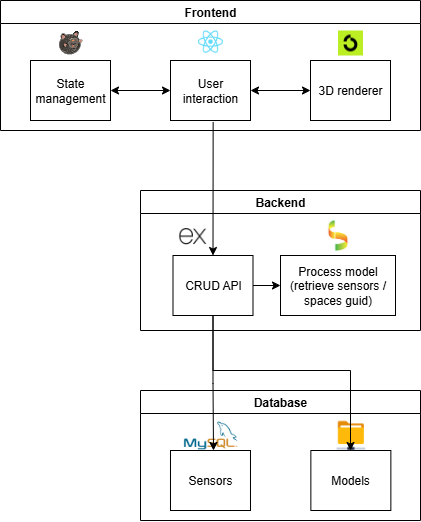
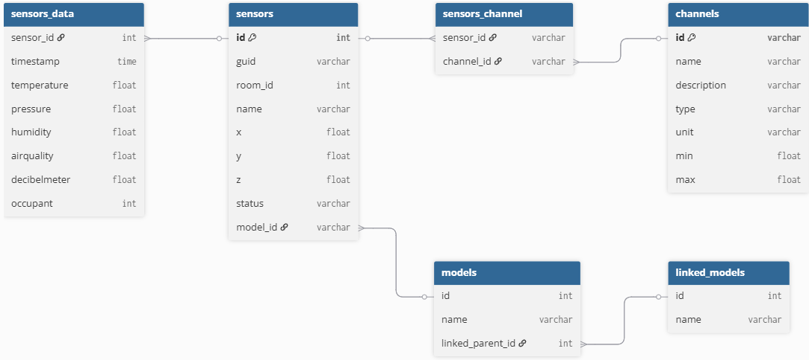
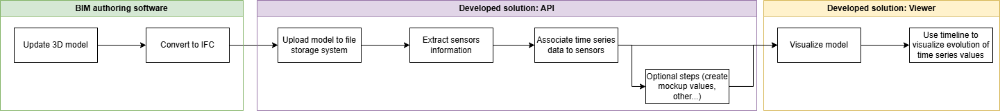
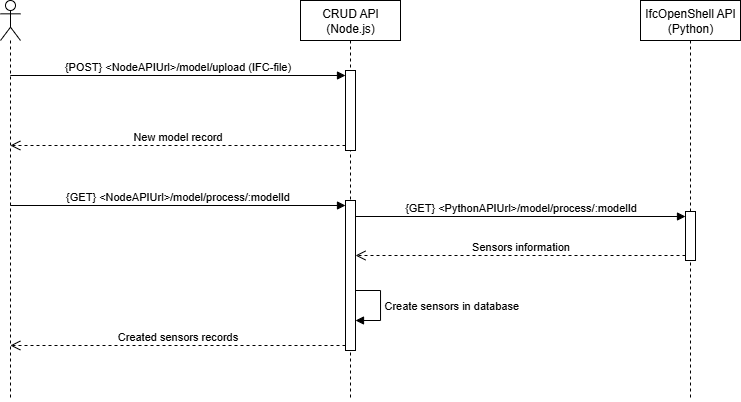
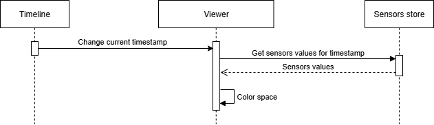
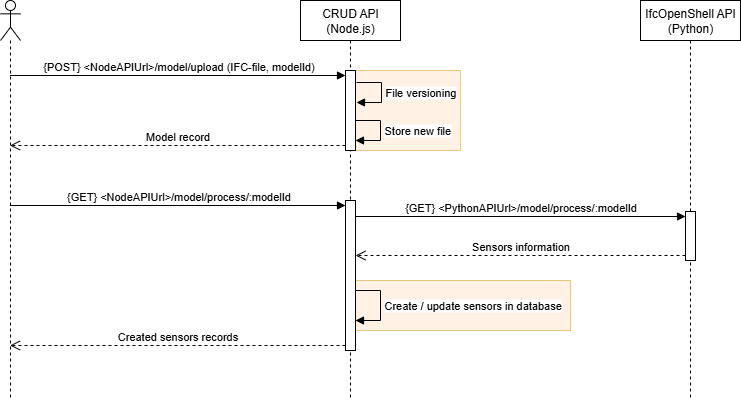

# Documentation

## Existing solutions

### APS

APS (Autodesk Platform Services) is a cloud-based developer platform which offers API for developer to create applications, integrations and extensions around Autodesk solutions. To create a digital twin web platform to visualize buildings, APS main advantage is the ability to interact with Autodesk’s solutions that are mainly designed towards the AEC field. Furthermore, they provide a web viewer SDK API, which is a powerful tool to visualize 2D and 3D models in a web application.
However, APS, like most of APS solutions is proprietary software and is not open-source. Also, APS stores the models and the data related to them by using Autodesk's cloud storage service OSS which itself use Amazon's solution, AWS S3. This means that the data is stored on Autodesk's servers, which may raise concerns about data privacy.

### Unity

Unity is a 

## File formats

To share information about buildings, several file formats have been developed, most of them being proprietary (e.g., Revit, AutoCAD, ArchiCAD) and therefore not suitable for this project. There are however some open-source formats:

- **IFC** (Industry Foundation Classes): A widely used open-source format for sharing building information models (BIM). It is supported by many AEC software applications and provides a comprehensive schema for representing building elements and their relationships.
- **gbXML** (Green Building XML): An open-source format specifically designed for sharing building performance data, such as energy analysis and sustainability information and is supported by several AEC software applications. As gbXML can only represent rectagular shapes and does not support complex geometries, it is often used in conjunction with other file formats, such as IFC.

### Performance

When dealing with large models, containing an important number of elements, performance can be an issue. While IFC files are excellent at storing information about relations between elements of a building, they are not optimized for rendering performance. That is why some file formats where created, optimized for 3D rendering:

- **glTF** (GL Transmission Format): [`glTF`](https://www.khronos.org/gltf/) is an open standard file format for 3D models and scenes, developed by the Khronos Group. It is designed to be efficient and easy to use, making it a popular choice for web applications and real-time rendering. However, glTF does not support the rich metadata and relationships between building elements that IFC provides, which can be a limitation when working with BIM data.
- **VIM**: [`VIM format`](https://github.com/vimaec/vim-format) is an open-source file format which has been developed load extremely large AEC models with high performance. It is now maintained by [`VIMAEC`](https://www.vimaec.com). The two reasons why VIM format was not considered for this project are that during the testing phase, spaces / rooms were not exported (even if the documentation says it should be supported) and that the converter from IFC (or Revit) files to VIM is a [proprietary software](https://docs.vimaec.com/docs/vim-for-developers/vim-for-developers).
- **Fragment**: [`Fragment`](https://docs.thatopen.com/fragments/schema) is a binary file format developed by `ThatOpenCompany` based on [`Flatbuffer`](https://flatbuffers.dev/) file format, which is an open-source serializing library orginally developed by Google. Using this file format, `ThatOpenCompany` libraries are more performant when it comes to load and display large IFC models. ⚠️ It is not possible to edit the Fragment files directly, [at the moment](#check-for-updates-concerning-engine_fragment-edit-apis), so if the model needs to be updated using the web application, the IFC file should be updated using another library (e.g., [`IfcOpenShell`](https://ifcopenshell.org/)) and then converted again to Fragment format.

## Web graphics

Although it is possible to create graphics in a web application using HTML, CSS and JavaScript, these technologies are not designed for high-performance graphics rendering. It is why WebGL has been developped. WebGL is a JavaScript API that allows to render 2D and 3D graphics in a web browser and using the GPU of the device to accelerate the rendering process and therefore improve the performance.

WebGL is a low-level API, which often means that it requires a good understanding of computer graphics and programming to use it effectively. To simplify the development process, [several high-level libraries and frameworks](https://gist.github.com/dmnsgn/76878ba6903cf15789b712464875cfdc) have been built on top of WebGL notably `Three.js`.

### Three.js

Three.js is a popular open-source JavaScript library that provides a high-level abstraction for creating and rendering 3D graphics in a web browser using WebGL. It simplifies the process of creating complex 3D scenes by providing a set of pre-built objects, materials, lights, and cameras that can be easily manipulated and combined to create rich 3D experiences.

There are also several libraries build on top of `Three.js` to provide additional features and tools for specific use cases, such as [`React Three Fiber`](https://github.com/pmndrs/react-three-fiber) which allows to use `Three.js` in a React application or [`Ifc.js`](https://github.com/ThatOpen/web-ifc-three) which provides tools to work with IFC files in a web application.

### Ifc.js and ThatOpenCompany's libraries

[`Ifc.js`](https://github.com/ThatOpen/web-ifc-three) is a, now deprecated, open-source JavaScript library that allows to import, parse and visualize IFC files in a web browser using `Three.js`. It provides a set of tools and functions to work with IFC files, such as loading and parsing the files, creating 3D geometries from the IFC data, and rendering the geometries in a web browser.

The project has been replaced by two libraries, both developed by [ThatOpenCompany](https://github.com/ThatOpen):
- [`engine_web-ifc`](https://github.com/ThatOpen/engine_web-ifc): A library to load and parse IFC files in a web application, providing tools to work with the IFC data.
- [`engine_components`](https://github.com/ThatOpen/engine_components): A library based on `engine_web-ifc` but also providing a set of pre-built components and tools to create 3D scenes and applications.

`engine_components` is one of the three main ThatOpenCompany's libraries, the two others being [`engine_fragment`](https://github.com/ThatOpen/engine_fragment) and [`engine_ui-components`](https://github.com/ThatOpen/engine_ui-components). Altogether, these three libraries provide a powerful set of tools to create web applications that focus on displaying 3D models and view model's items properties.

## Architecture

### Application



The application is divided into three main parts:

#### Frontend

To built the frontend, several libraries have been used:
- [`React`](https://react.dev/): A popular JavaScript library for building user interfaces. It provides a component-based architecture that allows to create reusable UI components and manage the state of the application.
- [`Next.js`](https://nextjs.org/): A React framework for building server-side rendered and statically generated web applications. It provides a set of features and tools to simplify the development process, such as automatic API routes, routing and middleware.
- [`Zustand`](https://github.com/pmndrs/zustand): A state management library for React applications. This library will be used to store the sensors data, values and the current state of the timeline.
- `ThatOpenCompany`'s libraries: A set of libraries to work with IFC files and create 3D scenes in a web application. The two main libraries used are `engine_fragment` (to load IFC file and parse its content) and `engine_components` (to create the 3D viewer).

#### Backend

The backend is divided into two different servers:
- **REST**: The main server, running on Node.js and using the [`Express`](https://expressjs.com/) framework to provide a REST API to perform CRUD operations on the sensors and models. The server also handle the upload of IFC file.
- **IfcOpenShell**: This server is only used to process the uploaded IFC files to extract information about the sensors placed in the model. This server is running on Python and use [`Flask`](https://flask.palletsprojects.com/en/stable/) to provide a REST API. Even though it is possible to send HTTP requests to this server directly, it is recommended to use the `process` endpoint of the CRUD server which will forward the request to the IfcOpenShell server.

> [!TIP]
> A [`Bruno`](https://www.usebruno.com/) collection is available [here](../back/bruno_collection/) to easily interact / test the API endpoints and get example and documentation for each endpoint.

#### Databases

There are two different databases:
- **MySQL**: A relational database used to store information about the models, sensors and sensor values. The database schema is described in the next section.
- **Model database**: A file storage to save the uploaded models (IFC files). The models are stored in a directory and renamed to match their id in the MySQL database.

### Database schema



> [!TIP]
> The database schema creation script is available [here](../database/create_tables.sql).

The database schema is composed of five main tables:
- **models**: Store information about the uploaded models. The `name` field is the name of the uploaded file. The `id` field is an auto-incremented integer that uniquely identifies each model. Once the model is uploaded and a new record is created in the database, the file is renamed to match its id (e.g., `1.ifc`, `2.ifc`, etc.). The "linked_model_id" field is a foreign key that references the id of the linked model that the model belongs to.
- **linked_models**: Store information about the linked models. A linked model is a model that is composed of multiple IFC files. It is not a standalone model that can be visualized on its own. When uploading a new model, a new linked model is automatically created, so that every model is part of a linked model. It is possible to specify the id of an existing linked model when uploading a new model to add the new model to the existing linked model.
- **sensors**: Store information about the sensors placed in the model. The `guid` field is the `GlobalId` of the `IfcSensor` element in the IFC file. The `room_id` field is the `GlobalId` of the `IfcSpace` element in which the sensor is located. The `x`/`y`/`z` fields are the coordinates of the sensor in the model. The `model_id` field is a foreign key that references the id of the model in which the sensor is located.
- **channels**: Store information about the different channels that can be measured by the sensors
- **sensors_data**: Store the values measured by the sensors.


There is also one junction table:
- **sensors_channel**: A junction table to define what channels a sensor is measuring. A sensor can measure multiple channels (e.g., temperature and humidity) and a channel can be measured by multiple sensors.

## System Workflow

### Pipeline overview

The following diagram illustrates the overall pipeline of the system:
1. **Update 3D model**: Update the 3D model using a CAD software (e.g., Revit). Sensors should also be placed in the model.
2. **Convert to IFC**: Convert the model to an IFC file (⚠️ `IfcSensor` elements only exist in the IFC4 schema. The endpoint only accepts IFC-STEP files ('.ifc'), no IFC-ZIP ('.ifczip'))
3. **Upload model**: Upload the updated model (IFC file) to the server.
4. (Optional) **Process model**: Process the model to extract information about the sensors placed in the model.
5. (Optional) **Create mock-up sensors or values**: Create mock-up sensors and/or values if no real sensors are available.
6. **Visualize model**: Visualize the model in the web application and interact with it.
7. **Use timeline**: Use the timeline component to visualize the sensor values at different times.



### Upload model

Use the API to upload a model (IFC file) to the server. When a model is uploaded, a new record is created in the `models` and `linked_models` tables of the database. It is also possible to "process" a model after it has been uploaded to the server. This process use `IfcOpenShell` to extract information about sensors placed in the model.



> [!WARNING]
> As the "IfcSensor" element only exists in the IFC4 schema, if the uploaded model uses the IFC2X3 schema, `IfcOpenShell` will look for "IfcDistributionControlElement" elements instead.

> [!TIP]
> It is possible to create fake sensors located in the center of each space and random values for each sensor using the following scripts:
> - [Mock-up sensors](../database/mock-up/sensor-mock-up.js)
> - [Mock-up sensor values](../database/mock-up/sensor-mock-up.js)

### Creating spaces in the 3D scene

According to [ThatOpenCompany's documentation](https://docs.thatopen.com/Tutorials/Fragments/Fragments/FragmentsModels/ModelInformation#-accessing-geometry-data:~:text=A%20key%20reason%20why%20a%20FragmentsModel%20is%20highly%20memory%2Defficient%20is%20that%20all%20BufferAttributes%20from%20the%20geometry%20in%20ThreeJS%20are%20removed%20after%20being%20used%20to%20render%20the%20model%20in%20the%20scene.), the `engine_fragment` library disposes of an object's `Three.js` attributes once it has been added to the scene. As a result, it becomes difficult to access an object's `Three.js` meshes through the `engine_fragment` library, since the spaces meshes are first added to a tile and then removed (this behaviour could change in [the future](#check-for-updates-concerning-engine_fragment-edit-apis)).
To overcome this issue, the spaces are recreated using `Three.js` after the model has been loaded and added to the scene. We then store the meshes of each space in a map, which allows us to efficiently access and update their colors later based on sensor data.

```javascript
async function retrieveSpaces() {
    if (!model) return;

    // Clear previous spaces
    spaces.clear();

    // Get all spaces from the model
    const finder = components.get(OBC.ItemsFinder);
    const spacesItems = await finder.getItems([
        {
            categories: [/^IFCSPACE$/],
        }
    ]);

    // Function to create a Three.js mesh from geometry data
    const createMesh = (data: FRAGS.MeshData) => {
        const meshMaterial = new THREE.MeshLambertMaterial({ color: "white" });
        const { positions, indices, normals, transform } = data;
        if (!(positions && indices && normals)) return null;
        const geometry = new THREE.BufferGeometry();
        geometry.setAttribute("position", new THREE.BufferAttribute(positions, 3));
        geometry.setAttribute("normal", new THREE.BufferAttribute(normals, 3));
        geometry.setIndex(Array.from(indices));

        const mesh = new THREE.Mesh(geometry, meshMaterial);
        mesh.applyMatrix4(transform);
        return mesh;
    };

    const promises = [];

    // Create a mesh for each space
    for (const [modelId, localIds] of Object.entries(spacesItems)) {
        const model = fragments.list.get(modelId);

        if (!model) continue;

        // Retrieve space item data and geometry
        const spaceItemData = await model.getItemsData([...localIds]);
        const spaceItemGeometry = await model.getItemsGeometry([...localIds]);

        for (const [index, spaceData] of spaceItemData.entries()) {
            // Store space data in the spaces map
            spaces.set(spaceData._guid.value, {
                id: spaceData._guid.value,
                modelId,
                localId: spaceData._localId.value,
                geometries: spaceItemGeometry[index],
                meshes: spaceItemGeometry[index]?.map((geom) => createMesh(geom))
            });

            if (spaces.get(spaceData._guid.value).meshes)
                spaces.get(spaceData._guid.value).meshes.forEach(mesh => world.scene.three.add(mesh));
        }

        promises.push(model.setVisible([...localIds], false));
    }

    await Promise.all(promises);
}
```

### Updating space colors based on sensor data

The following UML sequence diagram illustrates the process of updating space colors in the 3D scene. When the current time is updated through the timeline component, it triggers a hook in the viewer component. The viewer then retrieves the new sensor values corresponding to the updated time from the sensor store. Finally, it updates the colors of the spaces in the 3D scene based on these new sensor values.



## Improvements / next steps

### Check for updates concerning `engine_fragment` edit APIs

From the [ThatOpenCompany's documentation](https://docs.thatopen.com/migration#-exploder:~:text=Once%20we%20publish%20the%20Fragments%20edit%20API), it seems that the developers are working on adding edit APIs to the `engine_fragment` library. This API could provide functions to retrieve and modify a Three.js mesh of an item directly (instead of recreating it as done currently).

### Modify properties of IFC elements

Implement a way to modify the properties of IFC elements (e.g., name, type, material) directly from the 3D viewer. Using ThatOpenCompany's libraries, it is not 

### Improve model loading time

Improve the model loading time, especially in the case of linked models (with multiple IFC files). This could be done by:
- Loading the models in parallel instead of sequentially. 
- Converting the IFC files to Fragment files on the server side and only save the Fragment files. The loading time in the web application could then be reduced as the conversion process from IFC to fragment would not be required anymore (⚠️ need to add the conversion to the `upload model` process).

### Gradient color scale for spaces

Use a gradient color scale instead of a fixed color for each range of values as this would provide a more accurate representation of the sensor values. Implementing this would require to define how / where the gradient color should be displayed (e.g., using the gradient material on each face of the space's meshes would result in a very high number of colors and would not be very readable).

### Implement authentication and authorization

Implement authentication and authorization to restrict access to certain models.

### Upload a model from an external source

Might be interesting to allow users to specify an external source (e.g., an URL) to fetch the model from instead of uploading it directly to the server.

### Upload new version of a model (file versioning)

Implement a way to upload a new version of a model. This could be achieve by adding an additional, and optional, parameter to the upload model API specifing the id of the model. If this parameter is provided, the uploaded file will be considered as a new version of the model with the specified id.

It is also important to handle the extraction of information from the new model. It would be possible to use the `process` endpoint to extract the sensors from the new IFC file and update the `sensors` table with the new sensors. It is also feasible to use the [`IfcDiff`](https://docs.ifcopenshell.org/ifcdiff.html) tool from `IfcOpenShell` to two IFC files.



*Potential sequence diagram for the file versioning feature (necessary changes are highlighted in orange)*