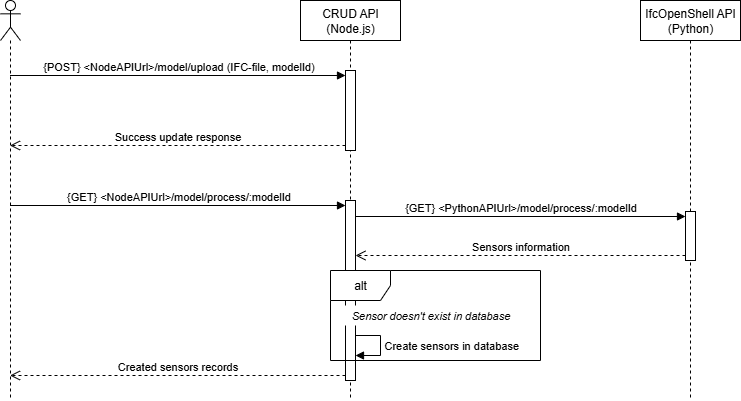
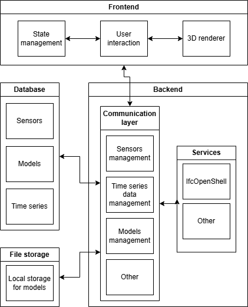

# Documentation

## Architecture

### Application


The application is divided into three main parts:

#### Frontend

To built the frontend, several libraries have been used:
- [`React`](https://react.dev/): A popular JavaScript library for building user interfaces. It provides a component-based architecture that allows to create reusable UI components and manage the state of the application.
- [`Next.js`](https://nextjs.org/): A React framework for building server-side rendered and statically generated web applications. It provides a set of features and tools to simplify the development process, such as automatic API routes, routing and middleware.
- [`Zustand`](https://github.com/pmndrs/zustand): A state management library for React applications. This library will be used to store the sensors information, time series data and the current state of the timeline.
- `ThatOpenCompany`'s libraries: A set of libraries to work with IFC files and create 3D scenes in a web application. The two main libraries used are `engine_fragment` (to load IFC file and parse its content) and `engine_components` (to create the 3D viewer).

##### State management
The sensors information and time series data are stored in a global state using store created with `Zustand`. Using a global state allows to easily access and update sensors information from any component in the application without having to rely on prop drilling or context providers, and therefore make the application more scalable and maintainable.

The store also provides a way to set the selected sensor and retrieve its associated time series data, which can then be used as a reactive data source for other components to display the values of the selected sensor. Also, the current time of the timeline is stored in the store, allowing to easily retrieve the sensor value at a given time and update the 3D scene accordingly.

The time series data from all sensors are stored in a single array, and two maps are used to index them by sensor ID and timestamp for efficient retrieval. Example:

```typescript
type SensorBinnedValue = {
    id: string;
    timestamp: number;
    temperature: number;
    pressure: number;
    humidity: number;
    air_quality: number;
    decibel: number;
}

SensorStore {
    // Array containing all sensor values
    values: SensorBinnedValue[
        { id: 'sensor1', timestamp: '2025-01-01', temperature: 22 },
        { id: 'sensor2', timestamp: '2025-01-01', temperature: 21 },
        { id: 'sensor1', timestamp: '2025-01-02', temperature: 23 },
        { id: 'sensor2', timestamp: '2025-01-02', temperature: 20 },
    ],
    _sensorsValuesMap: Map {
        'sensor1' => Map {
            '2025-01-01' => 0, // index in the values array
            '2025-01-02' => 2,
        },
        'sensor2' => Map {
            '2025-01-01' => 1,
            '2025-01-02' => 3,
        }
    },
    _timestampValuesMap: Map {
        '2025-01-01' => Map {
            'sensor1' => 0, // index in the values array
            'sensor2' => 1,
        },
        '2025-01-02' => Map {
            'sensor1' => 2,
            'sensor2' => 3,
        }
    }
}
```

#### Backend

The backend is divided into two different servers:
- **REST**: The main server, running on Node.js and using the [`Express`](https://expressjs.com/) framework to provide a REST API to perform CRUD operations on the sensors and models. The server also handle the upload of IFC file.
- **IfcOpenShell**: This server is only used to process the uploaded IFC files to extract information about the sensors placed in the model. This server is running on Python and use [`Flask`](https://flask.palletsprojects.com/en/stable/) to provide a REST API. Even though it is possible to send HTTP requests to this server directly, it is recommended to use the `process` endpoint of the CRUD server which will forward the request to the IfcOpenShell server.

> [!TIP]
> A [`Bruno`](https://www.usebruno.com/) collection is available [here](../back/bruno_collection/) to easily interact / test the API endpoints and get example and documentation for each endpoint.

#### Databases

There are two different databases:
- **MySQL**: A relational database used to store information about the models, sensors and sensor values. The database schema is described in the next section.
- **Model database**: A file storage to save the uploaded models (IFC files). The models are stored in a directory and renamed to match their id in the MySQL database.

### Database schema


> [!TIP]
> The database schema creation script is available [here](../database/create_tables.sql).

The database schema is composed of five main tables:
- **models**: Store information about the uploaded models. The `name` field is the name of the uploaded file. The `id` field is an auto-incremented integer that uniquely identifies each model. Once the model is uploaded and a new record is created in the database, the file is renamed to match its id (e.g., `1.ifc`, `2.ifc`, etc.). The "linked_model_id" field is a foreign key that references the id of the linked model that the model belongs to.
- **linked_models**: Store information about the linked models. A linked model is a model that is composed of multiple IFC files. It is not a standalone model that can be visualized on its own. When uploading a new model, a new linked model is automatically created, so that every model is part of a linked model. It is possible to specify the id of an existing linked model when uploading a new model to add the new model to the existing linked model.
- **sensors**: Store information about the sensors placed in the model. The `guid` field is the `GlobalId` of the `IfcSensor` element in the IFC file. The `room_id` field is the `GlobalId` of the `IfcSpace` element in which the sensor is located. The `x`/`y`/`z` fields are the coordinates of the sensor in the model. The `model_id` field is a foreign key that references the id of the model in which the sensor is located.
- **channels**: Store information about the different channels that can be measured by the sensors
- **sensors_data**: Store the values measured by the sensors.


There is also one junction table:
- **sensors_channel**: A junction table to define what channels a sensor is measuring. A sensor can measure multiple channels (e.g., temperature and humidity) and a channel can be measured by multiple sensors.

## System Workflow

### Pipeline overview

The following diagram illustrates the overall pipeline of the system:
1. **Update 3D model**: Update the 3D model using a BIM authoring software (e.g., Revit). Sensors should also be placed in the model.
2. **Convert to IFC**: Convert the model to an IFC file (⚠️ `IfcSensor` elements only exist in the IFC4 schema. The endpoint only accepts IFC-STEP files ('.ifc'), no IFC-ZIP ('.ifczip'))
3. **Upload model**: Upload the updated model (IFC file) to the server.
4. **Extract sensor**: Process the model to extract information about the sensors (e.g., guid, location, name, etc.) and store it in the database.
5. **Map time series data**: Associate time series data to the sensors (more about this [here](#attach-time-series-data-to-sensors))
6. (Optional) **Optional steps**: Run optional steps such as creating fake sensors, generating mock-up time series data, etc.
7. **Visualize model**: Visualize the model in the web application and interact with it.
8. **Use timeline**: Use the timeline component to visualize the sensor values at different times.


### Upload model

Use the API to upload a model (IFC file) to the server. When a model is uploaded, a new record is created in the `models` and `linked_models` tables of the database. It is also possible to "process" a model after it has been uploaded to the server. This process use `IfcOpenShell` to extract information about sensors placed in the model.


> [!WARNING]
> As the "IfcSensor" element only exists in the IFC4 schema, if the uploaded model uses the IFC2X3 schema, `IfcOpenShell` will look for "IfcDistributionControlElement" elements instead.

> [!TIP]
> It is possible to create fake sensors located in the center of each space and random values for each sensor using the following scripts:
> - [Mock-up sensors](../database/mock-up/sensor-mock-up.js)
> - [Mock-up sensor values](../database/mock-up/sensor-mock-up.js)

### Update model

It is possible to update an existing model by uploading a new IFC file using the same endpoint as for uploading a new model. The new file will replace the existing file on the server and an archive of the previous version will be created in the `archives` folder. It is also possible to use the "process" endpoint to extract the sensors from the new IFC file just like when uploading a new model. When updating a model, only new sensors will be added to the database. Existing sensors (with the same `guid` and `model_id`) will not be updated.



### Creating spaces in the 3D scene

According to [ThatOpenCompany's documentation](https://docs.thatopen.com/Tutorials/Fragments/Fragments/FragmentsModels/ModelInformation#-accessing-geometry-data:~:text=A%20key%20reason%20why%20a%20FragmentsModel%20is%20highly%20memory%2Defficient%20is%20that%20all%20BufferAttributes%20from%20the%20geometry%20in%20ThreeJS%20are%20removed%20after%20being%20used%20to%20render%20the%20model%20in%20the%20scene.), the `engine_fragment` library disposes of an object's `Three.js` attributes once it has been added to the scene. As a result, it becomes difficult to access an object's `Three.js` meshes through the `engine_fragment` library, since the spaces meshes are first added to a tile and then removed (this behaviour could change in [the future](#check-for-updates-concerning-engine_fragment-edit-apis)).
To overcome this issue, the spaces are recreated using `Three.js` after the model has been loaded and added to the scene. We then store the meshes of each space in a map, which allows us to efficiently access and update their colors later based on sensor data.

```javascript
async function retrieveSpaces() {
    if (!model) return;

    // Clear previous spaces
    spaces.clear();

    // Get all spaces from the model
    const finder = components.get(OBC.ItemsFinder);
    const spacesItems = await finder.getItems([
        {
            categories: [/^IFCSPACE$/],
        }
    ]);

    // Function to create a Three.js mesh from geometry data
    const createMesh = (data: FRAGS.MeshData) => {
        const meshMaterial = new THREE.MeshLambertMaterial({ color: "white" });
        const { positions, indices, normals, transform } = data;
        if (!(positions && indices && normals)) return null;
        const geometry = new THREE.BufferGeometry();
        geometry.setAttribute("position", new THREE.BufferAttribute(positions, 3));
        geometry.setAttribute("normal", new THREE.BufferAttribute(normals, 3));
        geometry.setIndex(Array.from(indices));

        const mesh = new THREE.Mesh(geometry, meshMaterial);
        mesh.applyMatrix4(transform);
        return mesh;
    };

    const promises = [];

    // Create a mesh for each space
    for (const [modelId, localIds] of Object.entries(spacesItems)) {
        const model = fragments.list.get(modelId);

        if (!model) continue;

        // Retrieve space item data and geometry
        const spaceItemData = await model.getItemsData([...localIds]);
        const spaceItemGeometry = await model.getItemsGeometry([...localIds]);

        for (const [index, spaceData] of spaceItemData.entries()) {
            // Store space data in the spaces map
            spaces.set(spaceData._guid.value, {
                id: spaceData._guid.value,
                modelId,
                localId: spaceData._localId.value,
                geometries: spaceItemGeometry[index],
                meshes: spaceItemGeometry[index]?.map((geom) => createMesh(geom))
            });

            if (spaces.get(spaceData._guid.value).meshes)
                spaces.get(spaceData._guid.value).meshes.forEach(mesh => world.scene.three.add(mesh));
        }

        promises.push(model.setVisible([...localIds], false));
    }

    await Promise.all(promises);
}
```

### Updating space colors based on sensor data

The following UML sequence diagram illustrates the process of updating space colors in the 3D scene. When the current time is updated through the timeline component, it triggers a hook in the viewer component. The viewer then retrieves the new sensor values corresponding to the updated time from the sensor store. Finally, it updates the colors of the spaces in the 3D scene based on these new sensor values.


## Improvements / next steps

### Check for updates concerning `engine_fragment` edit APIs

From the [ThatOpenCompany's documentation](https://docs.thatopen.com/migration#-exploder:~:text=Once%20we%20publish%20the%20Fragments%20edit%20API), it seems that the developers are working on adding edit APIs to the `engine_fragment` library. This API could provide functions to retrieve and modify a Three.js mesh of an item directly (instead of recreating it as done currently).

### Modify properties of IFC elements

Implement a way to modify the properties of IFC elements (e.g., name, type, material) directly from the 3D viewer. Using ThatOpenCompany's libraries, it is not 

### Improve model loading time

Improve the model loading time, especially in the case of linked models (with multiple IFC files). This could be done by:
- Loading the models in parallel instead of sequentially. 
- Converting the IFC files to Fragment files on the server side and only save the Fragment files. The loading time in the web application could then be reduced as the conversion process from IFC to fragment would not be required anymore (⚠️ need to add the conversion to the `upload model` process).

### Gradient color scale for spaces

Use a gradient color scale instead of a fixed color for each range of values as this would provide a more accurate representation of the sensor values. Implementing this would require to define how / where the gradient color should be displayed (e.g., using the gradient material on each face of the space's meshes would result in a very high number of colors and would not be very readable).

### Implement authentication and authorization

Implement authentication and authorization to restrict access to certain models.

### Upload a model from an external source

It might be interesting to allow users to specify an external source (e.g., an URL) to fetch the model from instead of uploading it directly to the server. A way to do this would be to store the model URL in the database and the fetch the model from the URL when needed.

### Application architecture

To improve the scalability and maintainability of the application, it could be interesting to structure the backend using a more modular architecture. In the diagram below, the backend is divided into two blocks:
- **Communication layer**: The API block is responsible for handling HTTP requests and responses. It uses the services block or perform requests on the databases to fullfill the requests and return the appropriate responses. This block could be considered as a "communication" layer as it is responsible for communicating with the different parts of the application.

- **Services**: The services block is responsible for handling more complex business logic and operations. It could be divided into multiple services (e.g., `IfcOpenShell` service to process IFC files, versioning service using `IfcDiff`, model conversion service using `engine_fragment` (to convert IFC files to Fragment files upon upload), etc.).

The software architecture would then look like this:



### Document database / Time series database

In a real-world scenario, different types of sensors would generate different types of time series data (e.g., temperature, humidity, occupancy, etc. (some sensors could also generate multiple types of data)). In this case, it would be more efficient to use a document or a time series database to store the sensor values instead of a relational database.