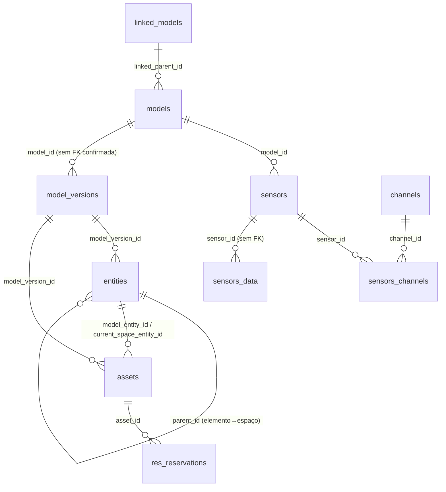
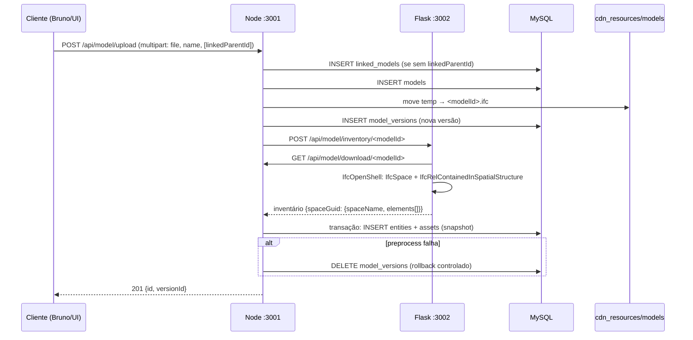

# Auditoria de Baseline — julho 2026

> Etapa 0 da refatoração sequencial (versionamento de modelos, identidade de espaços,
> ativos, grafo semântico e reservas). Este documento descreve o comportamento **atual**
> do sistema, tal como está no código — não o comportamento desejado.

---

## 1. Estrutura do repositório

```
oswadt/
├── back/                      # Backend Node.js (Express 5 + TypeScript, executado via tsx)
│   ├── index.ts               # Entrada: monta /api/sensor, /api/cdn, /api/model, /api/reservation, /api/asset
│   ├── routes/                # asset.ts, cdn.ts, model.ts, reservation.ts, sensor.ts
│   ├── services/              # preprocessService.ts (chama Flask + grava inventário)
│   ├── utils/                 # Classes de BD (singletons MySQL): model, sensor, asset, inventory, reservation
│   ├── types/                 # Tipos TS (models, sensors, database)
│   ├── scripts/               # seedSensorsData.ts (mock de sensors_data)
│   ├── cdn_resources/models/  # Ficheiros IFC gravados como <modelId>.ifc (+ archive/)
│   ├── python/                # Serviço Flask + IfcOpenShell (main.py, ifcopenshell_utils.py)
│   ├── bruno_collection/      # Coleção Bruno das APIs
│   ├── bruno_collection_backup/  # NÃO versionado (.gitignore)
│   └── tests/                 # Testes de caracterização (node:test via tsx) — criados nesta etapa
├── front/                     # Next.js 15 (App Router, Turbopack) + React 19
│   ├── app/(viewer)/viewer/   # Viewer original (sensores + timeline)
│   ├── app/(viewer)/student/  # Viewer de reservas (inventário, reservar, check-in/out)
│   ├── app/(admin)/dashboard/ # Stub ("Admin dashboard page")
│   ├── app/api/               # Proxies App Router → backend Node (usa BASE_API_URL)
│   ├── stores/sensorStore.ts  # Zustand
│   └── types/
├── database/
│   ├── create_tables.sql      # DDL: linked_models, models, sensors, channels, sensors_channels, sensors_data
│   └── mock-up/               # Scripts de mock de sensores (Node + Python)
└── documentation/             # Documentation.md, comparações, casos de uso, audit/ (este doc)
```

## 2. Comandos reais de execução

| Serviço | Diretório | Comando | Porta |
|---|---|---|---|
| Backend Node | `back/` | `npm run dev` (tsx index.ts) | 3001 (`PORT` no .env) |
| Serviço Python | `back/python/` | `./venv/Scripts/activate` e depois `flask --app main run -p 3002` | 3002 |
| Frontend | `front/` | `npm run dev` (next dev --turbopack) | 3000 |

Outros comandos:
- `back/`: `npm run build` = typecheck (`tsc --noEmit`); `npm test` = testes de caracterização; `npx tsx scripts/seedSensorsData.ts` = seed de dados de sensores.
- `front/`: `npm run build` = build de produção Next; `npx tsc --noEmit` = typecheck.
- `npm start` do backend (`node dist/index.js`) **não funciona** — o tsc nunca emitiu JS (antes emitia apenas .d.ts; agora é noEmit). O runtime real é sempre tsx.
- Não existe lint configurado em nenhum dos projetos. Não existiam testes antes desta etapa.

## 3. Variáveis de ambiente

| Ficheiro | Variáveis | Notas |
|---|---|---|
| `back/.env` | `PORT`, `DB_HOST`, `DB_PORT`, `DB_NAME`, `DB_USER`, `DB_PASSWORD`, `IFCOPENSHELL_FLASK_API_ROUTE`, `SENSORS_API_ROUTE` | `SENSORS_API_ROUTE` é usada por `routes/model.ts` (`GET /process/:id`) → aponta para o próprio Node (`http://localhost:3001/api/sensor`); faltava no `.env.example` (corrigido nesta etapa) |
| `back/python/.env` | `FLASK_API_PORT`, `MODEL_DOWNLOAD_ROUTE` | `MODEL_DOWNLOAD_ROUTE` = `http://localhost:3001/api/model/download` |
| `front/.env` | `BASE_API_URL`, `NEXT_PUBLIC_BASE_API_URL` | os proxies server-side usam `BASE_API_URL`; `NEXT_PUBLIC_BASE_API_URL` não é usada por nenhum código (resquício — pode ser removida do `.env`) |

## 4. Esquema de base de dados

### 4.1 Tabelas com DDL no repositório (`database/create_tables.sql`)

`linked_models`, `models`, `sensors`, `channels`, `sensors_channels`, `sensors_data` (+ seed de `channels`).

### 4.2 Tabelas usadas pelo código SEM DDL no repositório ⚠️

`model_versions`, `entities`, `assets`, `res_reservations` são referenciadas por
`inventoryDatabase.ts`, `assetDatabase.ts` e `reservationDatabase.ts`, mas **não existe
nenhum CREATE TABLE, migration ou script** para elas no repositório. O esquema só existe
na base de dados local de desenvolvimento.

**DDL inferida do código (hipótese a confirmar contra a BD real):**

```sql
CREATE TABLE model_versions (
  id INT NOT NULL AUTO_INCREMENT,
  model_id INT NOT NULL,            -- FK models.id (não confirmada)
  description VARCHAR(...) NULL,
  -- created_at provável mas não usado no código
  PRIMARY KEY (id)
);

CREATE TABLE entities (
  id INT NOT NULL AUTO_INCREMENT,
  guid VARCHAR(...) NOT NULL,       -- GlobalId IFC
  name VARCHAR(...) NULL,
  ifc_type VARCHAR(...) NULL,       -- ex.: IfcSpace, IfcFurniture, IfcSensor
  entity_type VARCHAR(...) NOT NULL,-- 'space' | 'element'
  model_version_id INT NOT NULL,    -- FK model_versions.id
  parent_id INT NULL,               -- entity do espaço que contém o elemento
  PRIMARY KEY (id)
);

CREATE TABLE assets (
  id INT NOT NULL AUTO_INCREMENT,
  name VARCHAR(...) NULL,
  asset_type VARCHAR(...) NOT NULL, -- 'space' | 'equipment'
  model_entity_id INT NOT NULL,     -- FK entities.id
  current_space_entity_id INT NULL, -- FK entities.id (NULL para espaços)
  model_version_id INT NOT NULL,    -- FK model_versions.id
  reservable BOOLEAN NOT NULL,      -- hoje: sempre true
  PRIMARY KEY (id)
);

CREATE TABLE res_reservations (
  id INT NOT NULL AUTO_INCREMENT,
  asset_id INT NOT NULL,            -- FK assets.id
  actor_id VARCHAR(...) NOT NULL,   -- string livre (ex.: 'pg202404'); não há tabela de atores
  start_time DATETIME NOT NULL,
  end_time DATETIME NOT NULL,
  status VARCHAR(...) NOT NULL,     -- 'pending'|'approved'|'in_use'|'completed'|'cancelled'|'no_show'
  checkin_time DATETIME NULL,
  PRIMARY KEY (id)
);
```

### 4.3 Diagrama das tabelas atuais



Nota: `sensors.room_id` guarda o **GUID IFC** do espaço (string), não uma FK para `entities`.

## 5. Fluxos atuais

### 5.1 Primeiro upload de modelo



### 5.2 Atualização de modelo (mesmo endpoint, com `modelId` no body)

1. Move `<modelId>.ifc` para `cdn_resources/models/archive/<timestamp>_<modelId>.ifc`.
2. Grava o novo ficheiro como `<modelId>.ifc` (o nome do ficheiro **não** inclui a versão).
3. Cria nova linha em `model_versions` e novo snapshot de `entities`/`assets`.
4. A tabela `models` não é alterada; a "versão atual" é implicitamente o maior `model_versions.id` do modelo.

### 5.3 Processamento de sensores (fluxo antigo, separado do inventário)

`GET /api/model/process/:id` (Node) → `POST /api/model/process/<modelId>` (Flask) →
IfcOpenShell extrai IfcSensor/IfcDistributionControlElement + espaço contentor →
Node cria linhas em `sensors` (skip por guid+model já existente) com todos os canais.

### 5.4 Reservas

- `POST /api/reservation/request` → valida: início no futuro, fim > início, sem conflito
  aprovado (`approved`/`in_use`/**`no_show`**), sem auto-conflito do ator (`pending`/`approved`) → INSERT `pending`.
- **Aprovação/rejeição: NÃO EXISTE** — nem endpoint nem UI. O estado `approved` só é
  atingível editando a BD manualmente. `rejected` não existe no código.
- `POST /api/reservation/checkin` → só `approved`, janela [início−20 min, início+10 min] (validada em SQL com NOW()) → `in_use`.
- `POST /api/reservation/checkout` → só `in_use` → `completed`.
- `POST /api/reservation/cancel` → só o próprio ator, só `pending`/`approved`, só até 24h antes do início → `cancelled`.
- No-show automático: cada chamada a métodos de reserva começa por marcar `approved` sem
  check-in e passados 10 min do início como `no_show` (lazy update, não é um job).

### 5.5 Decisão de reservabilidade (atual)

- Definida na criação do snapshot: **todos** os espaços e todos os elementos não-sensor
  recebem `reservable = true` (hardcoded no SQL de `inventoryDatabase.saveInventorySnapshot`).
- O frontend (student) mostra o botão "Reservar" se `asset.reservable` for truthy;
  elemento sem asset na última versão → "não pertence ao inventário".
- A disponibilidade (`GET /api/asset/availability/:assetId?start=&end=`) considera apenas
  reservas `approved`/`in_use` — `pending` **não** bloqueia a disponibilidade, mas o
  auto-conflito do ator considera `pending`.

### 5.6 Grafo RDF / SPARQL / ontologias / SHACL

**Não existe nada no código.** Nenhuma geração de RDF, nenhum triplestore, nenhum
endpoint SPARQL, nenhuma validação SHACL. Será tudo trabalho novo nas próximas etapas.

## 6. Utilização das tabelas pelo código

| Tabela | Escrita | Leitura |
|---|---|---|
| `linked_models` | upload (novo modelo sem parent) | listagem/metadata (front: lista de modelos) |
| `models` | upload | metadata, download |
| `model_versions` | upload/update (uma linha por processamento); DELETE no rollback | `getAssetByGuidLatest` (MAX id), `getAssetsByModel` |
| `entities` | snapshot de inventário | join por guid→asset |
| `assets` | snapshot de inventário | por guid+versão, por espaço+versão, por modelo+versão, por id+versão |
| `res_reservations` | request/checkin/checkout/cancel/no-show | por asset, por actor, disponibilidade |
| `sensors`, `sensors_channels` | process/:id, CRUD /api/sensor | viewer (por modelo) |
| `sensors_data` | seed scripts apenas | `/api/sensor/data` (agregação por bins) |

## 7. APIs cobertas pela coleção Bruno

- **Models**: upload, download, listagens, metadata, `Preprocess by modelId`
  (`POST /model/preprocess/:modelId/:versionId`), `Process model's spaces and sensors`
  (`GET /model/process/:id`), ⚠️ `Process inventory by modelId` aponta para
  `/model/inventory/:modelId` na porta do Node — essa rota só existe no **Flask** (3002);
  no Node não existe → request quebrada tal como está.
- **Reservation**: request, checkin, checkout, cancel, por actor, por asset,
  availability (`:assetId/:versionId` na URL, mas a rota Node só usa `:assetId` —
  o segundo segmento cai no route genérico `/:assetId/:versionId` de asset.ts?
  Não: a request usa `/asset/availability/:assetId/:versionId`, que na verdade
  faz match com `GET /api/asset/:assetId/:versionId` — ⚠️ discrepância), assets por
  espaço/versão/id, asset por GUID.
- **Sensors**: CRUD completo, dados, canais.

## 8. Discrepâncias código ↔ BD ↔ README ↔ documentação

1. **Tabelas novas sem DDL** (`model_versions`, `entities`, `assets`, `res_reservations`) — ver §4.2.
2. **README** não menciona: rotas de reserva/asset, página `/student`, seed
  `scripts/seedSensorsData.ts`, variável `SENSORS_API_ROUTE`, nem o serviço de inventário.
3. **`documentation/Documentation.md`** descreve o estado anterior (modelos+sensores);
  nada sobre versões/inventário/reservas.
4. **Bruno**: `Process inventory by modelId` aponta para rota inexistente no Node;
  `Asset avaiability` inclui `:versionId` que a rota de availability não aceita.
5. **`main.py`**: o bloco `if __name__ == "__main__": app.run()` está **antes** da rota
  `/api/model/inventory/<modelId>` — se alguém correr `python main.py` em vez de
  `flask --app main run`, a rota de inventário nunca é registada.
6. **`.env.example`** desatualizados (faltam `SENSORS_API_ROUTE`, `NEXT_PUBLIC_BASE_API_URL`).
7. `front/app/page.tsx` (rota `/`) ainda é o boilerplate do create-next-app;
  o dashboard admin é um stub.
8. O ficheiro IFC é sempre gravado como `<modelId>.ifc` — o conteúdo do ficheiro da
  versão N−1 vai para `archive/`, mas nenhuma tabela regista que ficheiro corresponde
  a que versão.

## 9. Lista de problemas conhecidos (baseline)

- **P1** — Sem fluxo de aprovação: reservas ficam `pending` para sempre sem intervenção manual na BD.
- **P2** — `reservable` sempre true: qualquer parede/porta inventariada é "reservável".
- **P3** — Identidade de espaços/ativos é por versão: cada novo upload cria **novas**
  entities/assets; reservas antigas apontam para assets de versões antigas; um asset
  "igual" na versão nova tem outro id (não há continuidade de identidade).
- **P4** — `sensors` liga a `models`+GUID de espaço, não a `entities` — dois mundos paralelos de identidade de espaços.
- **P5** — Conflito de reservas: `no_show` bloqueia novas reservas no mesmo intervalo (provavelmente indesejado).
- **P6** — Ficheiros IFC de versões antigas em `archive/` sem mapeamento para `model_versions`.
- **P7** — Singletons de BD com uma ligação MySQL cada (sem pool); ligação criada no import (efeito lateral).
- **P8** — Datas: mistura de hora local JS, `NOW()` do MySQL e strings ISO do cliente; sem timezone explícita.
- **P9** — `POST /api/model/upload` de update assume que `<modelId>.ifc` existe (rebenta se o ficheiro faltar) e não valida a extensão.
- **P10** — `actor_id` é uma string livre hardcoded no frontend (`pg202404`); não há autenticação.
- **P11** — Grafo semântico inexistente (será construído de raiz).
- **P12** — `sensors_data` tem colunas fixas por canal (temperature, humidity, …) em vez de usar `channels`.
- **P13** — *(confirmado em teste manual, 2026-07-15)* Atualizar um modelo com um IFC **sem IfcSpace** cria silenciosamente uma versão com inventário vazio: o Flask devolve `{}`, `saveInventorySnapshot` aceita `{}` sem erro e faz commit de zero entities/assets. Como `getAssetByGuidLatest` só procura na última versão, todo o inventário das versões anteriores fica invisível — o viewer passa a mostrar "não pertence ao inventário" para todos os elementos, embora os assets antigos continuem na BD com `reservable = 1`. O inventário também só inclui elementos contidos em IfcSpace: elementos fora de espaços nunca entram, mesmo em modelos com espaços. Correção sugerida para a etapa das migrations/inventário: rejeitar (ou pedir confirmação para) snapshots vazios e/ou registar aviso na resposta do upload.

## 10. Riscos antes das próximas etapas

- **R1** — Alterar o esquema sem DDL de referência: primeiro é preciso extrair o DDL real
  da BD de desenvolvimento (`SHOW CREATE TABLE`) e versioná-lo, senão qualquer migration é às cegas.
- **R2** — As correções de tipos desta etapa tocaram no código do viewer 3D; embora sejam
  casts/asserções sem mudança semântica, convém validar visualmente os dois viewers.
- **R3** — Comportamentos dependentes de tempo (janela de check-in, no-show, regra 24h)
  estão espalhados entre SQL e JS — refatorar sem os testes de caracterização a passar é arriscado.
- **R4** — O estado `approved` só é alcançável via SQL manual; qualquer teste E2E do
  check-in depende disso.
- **R5** — `front/package.json` não tem script de typecheck separado; o build é a única barreira.

## 11. Hipóteses ainda não confirmadas

- **H1** — DDL real das 4 tabelas novas (tipos, FKs, defaults, índices) — inferida em §4.2, não confirmada.
- **H2** — Se existe índice único em `entities (guid, model_version_id)` — o código assume unicidade mas protege apenas em memória (Set de guids do payload).
- **H3** — Comportamento com IFC 2x3 vs IFC 4 no inventário (o fluxo de sensores distingue schema; o de inventário não).
- **H4** — Se a BD de desenvolvimento tem dados que dependem do comportamento atual (ex.: reservas aprovadas à mão) que uma migration precisa de preservar.
- **H5** — `models.linked_parent_id` com `ON DELETE CASCADE`: apagar um linked_model apaga modelos — mas os ficheiros IFC ficam órfãos no disco (nunca testado).

## 12. Sequência recomendada das próximas migrations

1. **M0 — Congelar DDL real**: `mysqldump --no-data` da BD de dev → versionar em `database/`; conciliar com §4.2.
2. **M1 — model_versions**: adicionar `created_at`, `status` (ex.: processing/active/failed), `file_name` (mapear IFC ↔ versão, resolve P6); backfill.
3. **M2 — Identidade estável de espaços**: tabela de espaços canónicos por GUID IFC (independente de versão) + ligação `entities.space_id`; migrar `sensors.room_id` para FK (resolve P4).
4. **M3 — Identidade estável de ativos**: asset canónico com continuidade entre versões (match por GUID); `res_reservations` passa a apontar para o asset canónico (resolve P3).
5. **M4 — Reservas**: estados + máquina de estados explícita, fluxo de aprovação (endpoint/UI), rever regra `no_show`-bloqueia (P1, P5); `reservable` configurável (P2).
6. **M5 — Grafo semântico**: geração RDF a partir do inventário canónico; triplestore/endpoint SPARQL; SHACL (P11).

## 13. Comportamento manual que deve permanecer estável

Estes comportamentos foram caracterizados por testes (`back/tests/characterization/`) e
pelo procedimento manual (`MANUAL_TESTS.md`); as próximas etapas não devem alterá-los sem decisão explícita:

- Upload de IFC cria linked_model (quando aplicável), modelo, versão e inventário; falha no preprocess remove a versão criada.
- Elemento não inventariado no viewer student → mensagem "Elemento não pertence ao inventário."; inventariado e reservável → botão "Reservar".
- Regras de reserva: sem retroativas; fim > início; conflito approved/in_use/no_show; auto-conflito pending/approved; criação fica `pending`.
- Check-in só de reservas `approved` dentro da janela −20/+10 min; checkout só de `in_use`; cancelamento só pelo próprio, `pending`/`approved`, >24h antes.
- "Última versão" = maior `model_versions.id` do modelo.
- Viewer original: seleção de modelo carrega childModels, lista sensores, timeline colore espaços por temperatura.

## 14. Estado inicial registado (execução em 2026-07-14)

### Comandos executados e resultado

| Comando | Resultado inicial (antes das correções) | Resultado final |
|---|---|---|
| `back: npm install` | OK (warnings npm audit: 3 low) | OK |
| `back: npm run build` (tsc) | **FALHAVA — 44 erros de tipos** | OK (0 erros) |
| `front: npm install` | OK (warnings npm audit) | OK |
| `front: npx tsc --noEmit` | **FALHAVA — 98 erros de tipos** | OK (0 erros) |
| `front: npm run build` | **FALHAVA** (typecheck) | OK |
| `python: py_compile main.py ifcopenshell_utils.py` | OK | OK |
| `python: import flask, ifcopenshell` | OK (Flask 3.1.2, IfcOpenShell 0.8.4, Python 3.12.8) | OK |
| lint | não existe em nenhum projeto | — |
| testes | não existiam | `back: npm test` → 40/40 OK |

### Falhas preexistentes corrigidas nesta etapa (mínimas, sem mudança de comportamento)

- 142 erros de tipos (44 back + 98 front) corrigidos com casts `any`, non-null assertions,
  `@types/cors`, anotações de parâmetros — sem alteração de lógica em runtime.
- Código genuinamente inválido removido: função `handleCheckout` duplicada e tag `<html>`
  solta em `student/page.tsx`; funções mortas `checkAvailability`/`createReservation` em
  `student/Viewer.tsx` (referenciavam variáveis inexistentes; nunca eram chamadas).
- `back/tsconfig.json`: `emitDeclarationOnly` → `noEmit` (o tsc gerava `.d.ts` ao lado
  de cada fonte, poluindo o repositório; o runtime é tsx, o build é só typecheck).
- Assinatura de `front/app/api/sensor/data/route.ts` (segundo parâmetro `params` com tipo
  inválido para o validador do Next; o parâmetro nem era usado).

### Warnings relevantes que permanecem

- `npm audit`: vulnerabilidades low/moderate em dependências (não tratadas — fora de âmbito).
- Next build: aviso "Slow filesystem detected".
- Flask `__version__` deprecation (só no comando de verificação).
