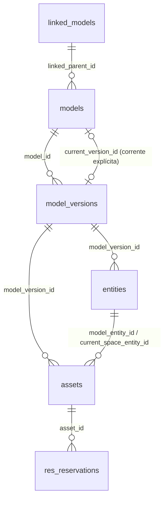
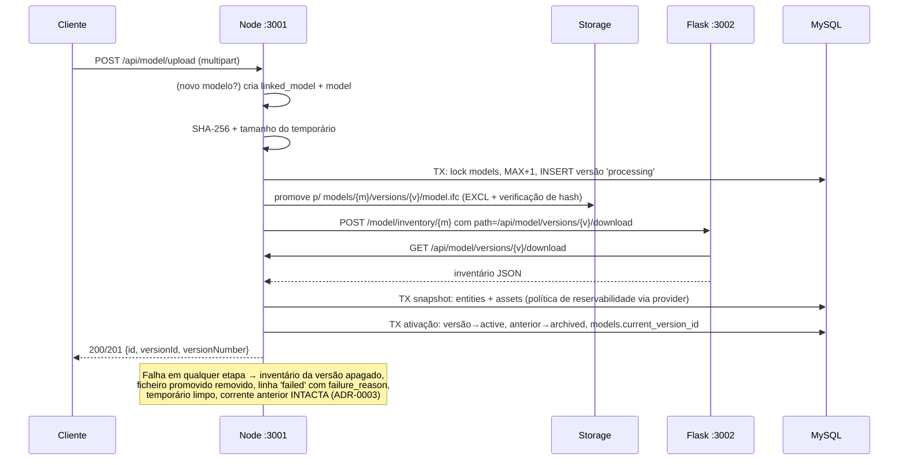

# Prompt 2 — Versionamento de modelos e ficheiros IFC imutáveis

> Etapa executada em 2026-07-16, sobre os resultados verificados dos Prompts 0 e 1.
> Decisões arquiteturais: ADR-0001 a ADR-0004 em `documentation/adr/`.

## 1. Significados adotados (conceito preservado rigorosamente)

| Tabela | Significado |
|---|---|
| `linked_models` | Federação/conjunto de modelos relacionados (ex.: "Laboratório"). Nunca é histórico. |
| `models` | Linha lógica persistente de um modelo (ex.: "Arquitetura"). Um upload de revisão NUNCA cria um novo model. |
| `model_versions` | Sucessivas revisões da linha lógica, numeradas por modelo (`version_number`), cada uma com o seu ficheiro imutável. |

## 2. Diagnóstico do versionamento anterior (auditoria §2 do prompt)

- **Decisão primeiro upload / revisão / novo modelo / federação**: presença de `modelId`
  no body → revisão; sem `modelId` e com `linkedParentId` → novo model na federação;
  sem ambos → novo linked_model + model.
- **Ficheiro**: sempre `models/<modelId>.ifc` (sobrescrito a cada revisão); anterior
  movido para `models/archive/<Date.now()>_<modelId>.ifc`; nome original perdido
  (só a extensão era usada); **sem hash, sem tamanho, sem ligação ficheiro↔versão**.
- **Versão corrente**: implícita — único uso era `assetDatabase.getAssetByGuidLatest`
  com `ORDER BY id DESC LIMIT 1` (nenhum outro lugar no código).
- **Python**: recebia o ficheiro por HTTP (`MODEL_DOWNLOAD_ROUTE/<modelId>` = ficheiro
  corrente) e devolvia JSON; `main.py` já suportava um campo `path` alternativo.
- **Momento de criação**: versão criada antes do preprocess; entities/assets no
  snapshot (transacional); em falha do preprocess a linha da versão era **apagada**.
- **Falhas**: upload interrompido deixava temporários do multer (2 encontrados);
  falha na escrita/rename podia deixar o modelo sem ficheiro corrente; versão vazia
  era ativável implicitamente (P13).
- **Migrations existentes**: `2026-07-15_add_overdue_status.sql` (+ rollback desta
  etapa); **não existe tabela de controlo** — aplicação manual documentada.
- **Sensores**: dependem de `model_id` + GUID de espaço; não dependem de caminhos.
- **Esquema real**: confirmado via snapshot 2026-07-15 (`entities` tem
  `UNIQUE(guid, model_version_id)`; `assets.model_version_id` tem ON DELETE CASCADE,
  `entities.model_version_id` não tem).

## 3. Modelo de dados implementado

`model_versions` (migration `2026-07-16_model_versioning.sql`):

```
id, model_id, version_number, status(processing|active|failed|archived),
storage_key, original_filename, file_hash(SHA-256), file_size,
description, created_at, created_by, activated_at, failure_reason
UNIQUE (model_id, version_number)
```

`models.current_version_id` → FK para `model_versions.id` (ON DELETE SET NULL).

**Estados**: `processing` = recebido, não concluído; `active` = válida e corrente;
`failed` = processamento não concluído (nunca ativável); `archived` = válida,
histórica, **recuperável** (não significa que o ficheiro deixou de existir).

**Número de versão seguro em concorrência** (documentação exigida em §3.3):
transação + `SELECT ... FOR UPDATE` na linha de `models` (serializa uploads do mesmo
modelo) → `MAX(version_number)+1` dentro do lock → INSERT; o
`UNIQUE(model_id, version_number)` é a proteção de último recurso, com um retry
único em `ER_DUP_ENTRY`. Coberto por teste.

**Versão corrente** (ADR-0001): só `processing` pode ser ativada; a ativação marca
`active` + `activated_at`, arquiva a anterior e atualiza `models.current_version_id`
na mesma transação. `getAssetByGuidLatest`, o download do viewer e `GET /:modelId/current`
resolvem pela referência explícita — o `ORDER BY id DESC` foi eliminado.

### Diagrama das tabelas (após Prompt 2)



## 4. Armazenamento imutável (ADR-0002)

- Novo layout: `models/{modelId}/versions/{versionId}/model.ifc` (relativo a
  `back/cdn_resources`, POSIX, persistido em `storage_key`).
- Nunca sobrescreve (`COPYFILE_EXCL`); hash verificado após a promoção; nome original
  é metadado; caminho gerado só de ids numéricos; `resolveStorageKey` bloqueia path
  traversal e caminhos absolutos; temporários em `models/temp`.
- Ficheiros legados (`models/<id>.ifc`, `models/archive/...`) ficam onde estão,
  referenciados por `storage_key` via backfill, e tornam-se imutáveis (o novo fluxo
  nunca mais escreve nesses caminhos).
- Reenvio do mesmo ficheiro: cria nova versão (ADR-0004 — comportamento atual
  preservado, sem deduplicação silenciosa).

## 5. Fluxo de upload por etapas



Primeiro upload (§7.1): linked_model → model → versão 1 → processa → ativa → corrente.
Revisão (§7.2): mesmo linked_model, mesmo model, nova versão; anteriores preservadas.
Federação (§7.3): cada model da federação tem a sua corrente; **revisão federada
global (combinação histórica de versões) fica documentada como trabalho posterior** —
não implementada.

## 6. Migration, rollback e backfill

- Forward: `database/migrations/2026-07-16_model_versioning.sql` (aplicada).
- Rollback: `..._model_versioning_rollback.sql` — restaura o esquema anterior; avisa
  que os metadados novos se perdem; **não** apaga ficheiros, reservas, nem reverte o
  ENUM com `overdue` (verificado por testes `guards.test.ts`).
- Runner: `back/scripts/runSqlFile.ts` (não existe tabela de controlo de migrations —
  aplicação manual; convenção de nomes por data mantida).
- Backfill: `back/scripts/backfillModelVersions.ts` (`--report` default / `--apply`),
  lógica pura testável em `scripts/lib/backfillPlanner.ts`. Executado em 2026-07-16:

| Versão | Modelo | nº | Status | Classificação | storage_key |
|---|---|---|---|---|---|
| 1 | 1 | 1 | active (corrente) | current_file_associated | models/1.ifc |
| 2 | 2 | 1 | archived | **ambiguous_file** (9 archives p/ 2 versões) | — |
| 3 | 2 | 2 | archived | **ambiguous_file** | — |
| 4 | 2 | 3 | active (corrente) | current_file_associated | models/2.ifc |
| 5 | 3 | 1 | archived | historical_file_associated | models/archive/1784135203791_3.ifc |
| 6 | 3 | 2 | archived | historical_file_associated | models/archive/1784152917704_3.ifc |
| 7 | 3 | 3 | archived | historical_file_associated | models/archive/1784166243185_3.ifc |
| 8 | 3 | 4 | active (corrente) | current_file_associated | models/3.ifc |

  - Associação de archives por **contagem ordinal** (só quando nº de archives ==
    nº de versões históricas do modelo), verificada contra o conteúdo dos IFC
    (a v6 é o ficheiro sem IfcSpace). A correspondência por janela temporal foi
    rejeitada: há desvio entre `Date.now()` e o `NOW()` do MySQL nesta máquina.
  - **Órfãos** (reportados, não tocados, sem metadados inventados): ficheiros
    correntes `4.ifc`–`10.ifc` (modelos apagados da BD em fevereiro) e 16 archives
    não associáveis (maioritariamente do modelo 2 e de modelos apagados).
  - Idempotente: 2.ª execução é no-op (verificado).

## 7. APIs

Novas (Node, prefixo `/api/model`):

| Rota | Função |
|---|---|
| `GET /:modelId/versions` | listar versões (nº, estado, hash, tamanho, is_current) |
| `GET /:modelId/current` | metadados da versão corrente (referência explícita) |
| `GET /versions/:versionId` | metadados de uma versão |
| `GET /versions/:versionId/download` | descarregar o ficheiro de uma versão (corrente ou histórica); 404 explícito quando o histórico não é recuperável |

Compatibilidade preservada: `POST /upload` (mesmo contrato + `versionNumber` extra na
resposta), `GET /download/:id` (viewer — resolve agora a corrente explícita, com
fallback legado), `/linked`, `/process/:id` (sensores), `/preprocess`, proxies do
frontend, federação, providers de política, reservas e coleção Bruno (5 requests
novas em Models).

## 8. Preservação das fronteiras de políticas

O upload continua a chamar o provider configurado (a decisão de reservabilidade vive
no snapshot, atrás de `getReservabilityEvaluator`); nenhuma regra inline de classe IFC
foi reintroduzida (teste-guarda a varrer routes/services/utils/scripts); o Python
continua sem decidir reservabilidade; `ReservationRequestValidator` e os logs
`policy_evaluation` estão intocados. Os estados `processing/active/failed/archived`
são de versionamento e NÃO entraram no contrato `PolicyEvaluationResult`.

## 9. Limitações e casos históricos não recuperáveis

- Modelo 2: as versões 1–2 ficam sem ficheiro associado (9 archives candidatos,
  impossível distinguir com segurança) — o download dessas versões devolve
  `404 ... has no recoverable file (historical limitation)`.
- Ficheiros órfãos `4.ifc`–`10.ifc` e 16 archives permanecem no disco, listados no
  relatório do backfill; não foram associados nem apagados.
- Não existe reprodução de combinações federadas históricas (trabalho futuro).
- Registo de versões `failed` começa nesta etapa; falhas anteriores não têm rasto.

## 10. Testes manuais — ver secção "Prompt 2" em MANUAL_TESTS.md
