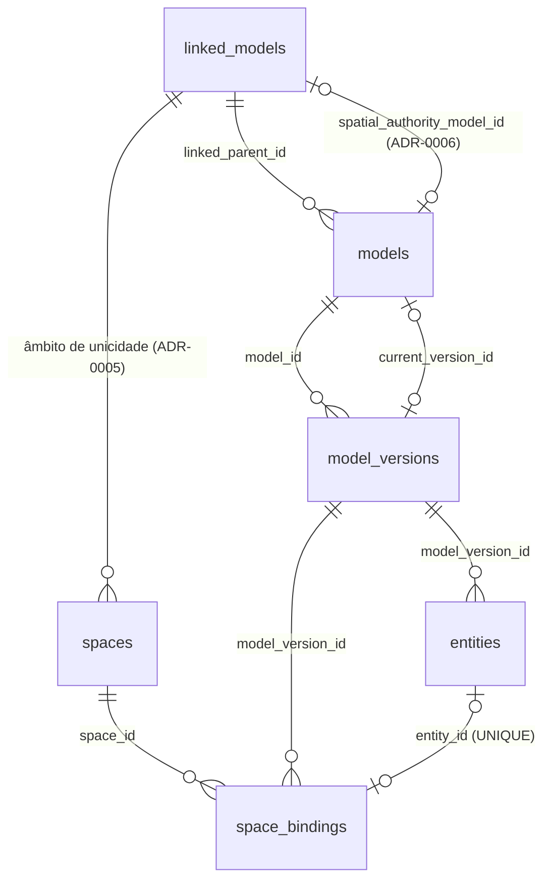

# Prompt 3 — Identidade persistente dos espaços

> Etapa executada em 2026-07-16, sobre os resultados verificados dos Prompts 0–2.
> Decisões arquiteturais: ADR-0005 (âmbito de unicidade), ADR-0006 (autoridade
> espacial), ADR-0007 (duplicações), ADR-0008 (espaços ausentes),
> **ADR-0009 (spatial_preflight estrito — revisão de 2026-07-16)**.
> **Não** migra ativos nem reservas (Prompt 4).

> ⚠️ **DECISÃO SUBSTITUÍDA (revisão do Prompt 3)** — as passagens deste
> documento que dizem que "espaços sem código continuam com o comportamento
> legado e não bloqueiam o upload" valem apenas para modelos NÃO autoritativos.
> Para o modelo espacial autoritativo vigora a regra estrita do ADR-0009:
> - sem nenhum IfcSpace → upload rejeitado (422, spatial_preflight);
> - qualquer IfcSpace sem Reference válido → upload rejeitado (sem aceitação
>   parcial), com diagnóstico agregado e contagem;
> - duplicados → rejeitados no preflight, antes de qualquer persistência.
> O Reference identifica o espaço; NÃO determina reservabilidade; a fonte é
> substituível por provider (SPACE_IDENTITY_PROVIDER); continua sem
> ontologia/SHACL/SPARQL.

## 1. Auditoria (resultados verificados em 2026-07-16)

- **Extração Python**: `extract_inventory_by_space` lia só `GlobalId` e `Name`
  dos IfcSpace; **nenhum property set era lido**; `Pset_SpaceCommon.Reference`
  não aparecia em payloads, fixtures, testes, scripts nem tabelas.
- **IFCs reais**: 0 de 58 IfcSpace têm `Pset_SpaceCommon.Reference`
  (ModeloA/TestGRIDD: 2 espaços; cantina UMinho: 54 espaços com `Name` numérico
  e `LongName` descritivo; casa_modelo e Project1: **sem IfcSpace**). Logo, a
  identidade persistente começa vazia até existirem IFCs com o pset — o gerador
  de fixtures (`back/python/make_space_fixture.py`) cobre os testes.
- **Federação**: cada `linked_model` tem exatamente 1 model → autoridade
  espacial inferível pela regra por omissão (ADR-0006); a coluna
  `spatial_authority_model_id` cobre federações futuras.
- **Persistência atual**: entities de espaço guardam guid/name/ifc_type/versão —
  **não guardam código** → o backfill exige reprocessar o IFC (fluxo Node–Python
  existente; requer backend + Flask a correr; `SELF_API_BASE`/porta respeitados).
- **Consumidores de entity de espaço**: `assets.current_space_entity_id` (por
  versão), rota `/api/asset/by-space/:entityId/:versionId`, sensores via GUID
  (`sensors.room_id`) — nenhum é alterado nesta etapa.
- **Ficheiros**: pós-wipe, todas as versões ativas/arquivadas têm `storage_key`
  válido (layout novo); a única versão sem ficheiro é a `failed` do teste 14.3.
  As classificações ambíguas do Prompt 2 pertenciam aos dados pré-wipe.

## 2. Conceito: entidade versionada vs espaço persistente

- `entities` (entity_type='space') = **o IfcSpace de uma versão** (efémero,
  multiplicado a cada upload);
- `spaces` = **o espaço físico/operacional persistente**, identificado pelo
  código de inventário — convenção/perfil deste projeto:
  `Pset_SpaceCommon.Reference` = código de inventário (NÃO é uma definição
  universal do IFC);
- `space_bindings` = como um espaço persistente aparece numa versão concreta
  (espaço ↔ versão ↔ entity, com snapshots de código/nome/longName).

Regra central: **mesmo código de inventário no mesmo âmbito = mesmo espaço
persistente**. GUID, nome, geometria e versão não são identidade; o GUID fica
apenas como rastreabilidade/diagnóstico nos bindings.

Regras de identidade implementadas e testadas:

| Situação | Resultado |
|---|---|
| mesmo Reference + GUID diferente | mesmo `space_id` |
| mesmo Reference + nome diferente | mesmo `space_id` |
| GUID igual + Reference diferente | espaço persistente **diferente** |
| Reference novo | espaço novo |
| Reference ausente/vazio/whitespace/tipo inesperado | **sem** espaço persistente (diagnóstico) |

## 3. Esquema (migration `2026-07-16_space_identity.sql`, aplicada)



- `spaces`: `space_uuid` (estável), `inventory_code` (original) +
  `inventory_code_normalized` (trim apenas — normalização conservadora),
  `linked_model_id`, `name`, `semantic_uri` (**nullable, nunca inventada —
  adiada**), `status ENUM(active|absent|retired)`, timestamps, `retired_at`.
  `UNIQUE(linked_model_id, inventory_code_normalized)` (ADR-0005) e
  `UNIQUE(space_uuid)`.
- `space_bindings`: `UNIQUE(entity_id)` (uma entity nunca liga a dois espaços)
  e `UNIQUE(space_id, model_version_id)` (um binding por espaço por versão) —
  compatíveis com os dados atuais; múltiplas representações do mesmo código na
  mesma versão são exatamente o caso de duplicação (ADR-0007), nunca dois
  bindings. Versão sempre explícita; sem `is_current` (a corrente vem só de
  `models.current_version_id`); `storage_key`/ficheiros intocados.
- Rollback: `2026-07-16_space_identity_rollback.sql` — remove só as estruturas
  novas; avisa da perda; não toca em entities/assets/reservas/ficheiros/
  `current_version_id`/`overdue` (verificado por teste-guarda).

## 4. SpaceIdentityResolver

`back/identity/` (deliberadamente FORA de `back/policies/` — identidade não é
política; guarda automatizada verifica a ausência de imports cruzados):

- `types.ts`: `SpaceIdentityResolver.resolve(candidate, context)` →
  `{status: valid|missing|invalid|duplicate, rawValue, normalizedValue, source,
  reasons, resolverId, resolvedAt, guid}`;
- `psetReferenceSpaceIdentityResolver.ts`: centraliza o nome do pset
  (`Pset_SpaceCommon`), da propriedade (`Reference`), a validação (ausente →
  missing; vazio/whitespace/tipo inesperado → invalid) e a normalização
  (apenas trim; caixa, zeros iniciais e interior preservados);
- `spaceIdentityProvider.ts`: getter/setter próprios (extensível no futuro;
  sem ontologia/SHACL/SPARQL/chamadas externas).

O Python apenas extrai (agora envia `spaceLongName` + `psets` completos por
espaço); a resolução da identidade e TODAS as escritas SQL ficam no Node
(`services/spaceIdentityService.ts` + `utils/spaceDatabase.ts`).

Separação de responsabilidades: o resolver responde "que espaço persistente é
este?"; o `ReservabilityEvaluator` responde "pode ser reservado?". A ausência
de Reference **não** altera a reservabilidade legada (testado); nenhum ativo é
criado por causa da identidade.

## 5. Integração no upload (modelUploadService)

```
processing → entities + ativos legados (política) → spatial_identity
  (resolução + spaces + space_bindings) → activation → reconciliação de
  estados espaciais (só modelo autoritativo)
```

- Falha na etapa espacial (ex.: duplicação em modelo autoritativo) → versão
  `failed` com razão `spatial_identity: ...`, corrente anterior intacta,
  compensação estendida: bindings removidos ANTES das entities (FK), espaços
  criados exclusivamente pela operação e sem outros bindings removidos
  (guarda `NOT EXISTS` — espaços preexistentes nunca são apagados), inventário
  parcial, ficheiro promovido e temporários seguem o Prompt 2.
- Versões `failed` nunca expõem bindings (a compensação apaga-os) e nunca
  fornecem espaços correntes (nunca são ativadas).
- Modelos sem federação (`linked_parent_id NULL`): etapa espacial ignorada com
  normalidade (sem âmbito de unicidade aplicável).

## 6. Divisões, fusões, renumeração e desaparecimento

Sem inferência de linhagem (GUID, nome, geometria, área e proximidade
proibidos): divisão → dois espaços novos, o antigo fica `absent` com histórico;
fusão → espaço novo, os dois anteriores preservados; código mantido → identidade
acompanha o código; renumeração → nova identidade (relação explícita de
renumeração fica para o futuro). Ausência numa versão autoritativa ativa marca
`absent` (ADR-0008), nunca apaga; ausência em modelo não autoritativo não faz
nada. Casos `absent` são o input da reconciliação de ativos no Prompt 4.

## 7. Backfill (`back/scripts/backfillSpaces.ts`)

- `--report` (default, não escreve) / `--apply`; idempotente (entity já com
  binding → `already_bound`).
- ⚠️ Requer backend Node e Flask a correr: as entities não guardam o código,
  portanto a única fonte é o reprocessamento do ficheiro da versão via
  `storage_key` + fluxo Node–Python existente (sem mecanismo paralelo).
- Não reprocessa: versões `failed`; versões sem `storage_key` (pós-Prompt 2,
  cobre ausente/ambíguo/irrecuperável — a distinção fina vivia no relatório do
  Prompt 2 sobre os dados pré-wipe, que já não existem na BD).
- Classificações: `space_identity_created`, `space_binding_created`,
  `missing_reference`, `invalid_reference`, `duplicate_reference` (diagnóstico,
  nunca desativa versões históricas), `source_file_unavailable`,
  `skipped_failed_version`, `already_bound`, `reprocess_error`.
- **Limitação histórica atual**: os IFCs existentes não têm o pset → o backfill
  real produz `missing_reference` para todos os espaços atuais. Honesto e
  esperado; identidades passam a nascer nos uploads novos com fixtures/modelos
  atualizados.

## 8. APIs novas (leitura; Bruno → pasta "Spaces")

| Rota | Função |
|---|---|
| `GET /api/space/linked/:linkedModelId` | espaços persistentes da federação (código, uuid, status) |
| `GET /api/space/:spaceId/bindings` | histórico de bindings de um espaço (por versão) |
| `GET /api/space/version/:versionId/bindings` | bindings de uma versão explícita |

## 9. Compatibilidade preservada

93 testes anteriores intactos (total agora 132); APIs de versões, viewer,
download corrente, sensores, providers de política, logs `policy_evaluation`,
regras de reservas/datas/overdue, `SELF_API_BASE`, fluxo Node–Python e P14 —
tudo sem alteração. Nada de RDF/URI obrigatória/aprovação; nenhuma coluna
legada removida; `space_id` não é exigido em nenhuma API antiga; a lista
legada de ativos reserváveis não foi reduzida.

## 10. Fixtures para testes manuais

`back/python/make_space_fixture.py` gera IFCs controlados (nunca altera
ficheiros reais):

```bash
cd back/python
./venv/Scripts/python.exe make_space_fixture.py saida.ifc \
  --space "R-101:Sala 101" --space "R-102:Sala 102" --space ":Sem Codigo"
# CODIGO:Nome[:GUID] — código vazio omite o pset; GUID fixo permite testar
# "GUID igual, código diferente" entre dois ficheiros
```

## 11. Testes manuais — ver secção §15 em MANUAL_TESTS.md
